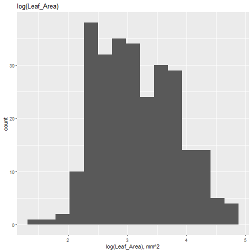
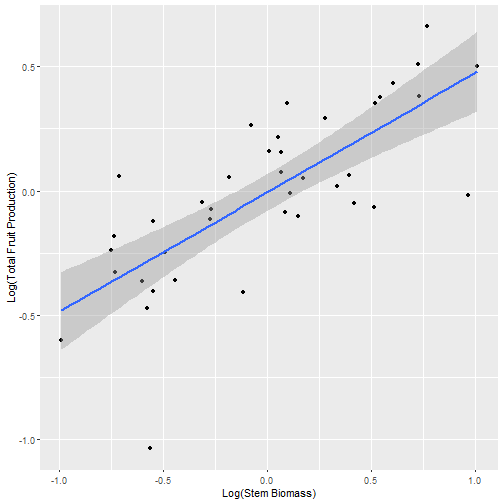
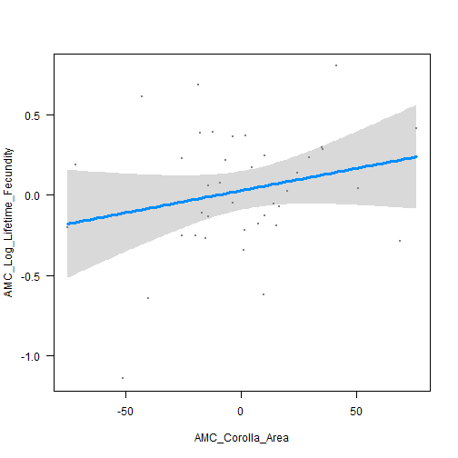

```r
# Putting data-transforming packages into R
# Don't forget to also import in the csv file with all the data

library(ggplot2)
library(dplyr)
library(visreg)
library(tidyverse)
library(readr)
library(lubridate)


AC_Data_2022 <- read_csv("~/MazerResearchProject/Data/AC_Data_2022.csv")
```

```
## Rows: 319 Columns: 23
## ── Column specification ────────────────────────────────────────────────────────────────────────
## Delimiter: ","
## chr  (6): Population, Generation, Donor, Recipient, FFD, LFD
## dbl (16): Field_Year, Block, Transect, Sequence, Plant_ID, Total_Closed_Fruits, Total_Fruits...
## lgl  (1): Left_Or_Right
## 
## ℹ Use `spec()` to retrieve the full column specification for this data.
## ℹ Specify the column types or set `show_col_types = FALSE` to quiet this message.
```

```r
#Do the following using mutate:

AC_Data_2022 <- AC_Data_2022 %>% mutate(FFD = yday(mdy(FFD)), LFD = yday(mdy(LFD)), Flowering_Duration = LFD-FFD) # Change the date as a character variable to month-day-year, and then change this to a number between 1 and 365

AC_Data_2022$Flowering_Duration - AC_Data_2022$fl_duration
```

```
##   [1]  0  0  0  0  0  0  0  0  0  0  0  0  0  0  0  0  0  0  0  0  0  0  0  0  0  0  0  0  0  0
##  [31]  0  0  0  0  0  0  0  0  0  0  0  0  0  0  0  0  0  0  0  0  0  0  0  0  0  0  0  0  0  0
##  [61]  0  0  0  0  0  0  0  0  0  0  0  0  0  0  0  0  0  0  0  0  0  0  0  0  0  0  0  0  0  0
##  [91]  0  0  0  0  0  0  0  0  0  0  0  0  0  0  0  0  0  0  0  0  0  0  0  0  0  0  0  0  0  0
## [121]  0  0  0  0  0  0  0  0  0  0  0  0  0  0  0  0  0  0  0  0  0  0  0  0  0  0  0  0  0  0
## [151]  0  0  0  0  0  0  0  0  0  0  0  0  0  0  0  0  0  0  0  0  0  0  0  0  0  0  0  0  0  0
## [181]  0  0  0  0  0  0  0  0  0  0  0  0  0  0  0  0  0  0  0  0  0  0  0  0  0  0  0  0  0  0
## [211]  0  0  0  0  0  0  0  0  0  0  0  0  0  0  0  0  0  0  0  0  0  0  0  0  0  0  0  0  0  0
## [241]  0  0  0  0  0  0  0  0  0  0  0  0  0  0  0  0  0  0  0  0  0  0  0  0  0  0  0  0  0  0
## [271]  0  0  0  0  0  0  0  0  0 NA  0  0  0  0  0  0  0  0  0  0  0  0  0  0  0  0  0  0  0  0
## [301]  0  0  0  0  0  0  0  0  0  0  0  0  0  0  0  0  0  0  0
```

```r
#AC_Data_2022$FFD <- mdy(AC_Data_2022$FFD) # Converts character variable to month-day-year, which can then be converted to day-of-year

#AC_Data_2022$FFD <- yday(AC_Data_2022$FFD) # Converts Date variable to day-of-year, which is a numeric variable, and  can be mean-centered


#AC_Data_2022$LFD <- mdy(AC_Data_2022$LFD)

#AC_Data_2022$LFD <- yday(AC_Data_2022$LFD)

hist(AC_Data_2022$FFD)
```


```r
plot(AC_Data_2022$FFD, AC_Data_2022$LFD)
```


```r
plot(AC_Data_2022$FFD, AC_Data_2022$Flowering_Duration)
```


```r
plot(AC_Data_2022$LFD, AC_Data_2022$Flowering_Duration)
```


########################################################################################
############################### DATA PREPARATION ####################################### 
########################################################################################


# Visualize frequency distributions of traits (raw values and log-transformed) to see which ones may need transformation prior to analysis


```r
names(AC_Data_2022)
```

```
##  [1] "Population"            "Field_Year"            "Generation"           
##  [4] "Block"                 "Transect"              "Sequence"             
##  [7] "Left_Or_Right"         "Donor"                 "Recipient"            
## [10] "Plant_ID"              "Total_Closed_Fruits"   "Total_Fruits"         
## [13] "Tot_Seed_Num_ClosedFt" "Mean_Ind_Seed_Mass_mg" "Mean_Seeds_per_Fruit" 
## [16] "Lifetime_Fecundity"    "Stem_Biomass"          "Corolla_Diameter"     
## [19] "Corolla_Area"          "Leaf_Area_mm2"         "FFD"                  
## [22] "LFD"                   "fl_duration"           "Flowering_Duration"
```

```r
ggplot(AC_Data_2022, aes(Total_Fruits)) +
  geom_histogram(bins=15) +
  xlab("Total_Fruits") +
  ggtitle("Total_Fruits")
```


```r
ggplot(AC_Data_2022, aes(log(Total_Fruits))) +
  geom_histogram(bins=15) +
  xlab("Log(Total Fruits)") +
  ggtitle("Log(Total_Fruits)")
```

```
## Warning: Removed 11 rows containing non-finite values (`stat_bin()`).
```


```r
#***************
ggplot(AC_Data_2022, aes(Mean_Ind_Seed_Mass_mg)) +
  geom_histogram(bins=15) +
  xlab("Mean_Ind_Seed_Mass_mg") +
  ggtitle("Mean_Ind_Seed_Mass_mg")
```

```
## Warning: Removed 41 rows containing non-finite values (`stat_bin()`).
```


```r
#***************
ggplot(AC_Data_2022, aes(Mean_Seeds_per_Fruit)) +
  geom_histogram(bins=15) +
  xlab("Mean_Seeds_per_Fruit") +
  ggtitle("Mean_Seeds_per_Fruit")
```


```r
ggplot(AC_Data_2022, aes(log(Mean_Seeds_per_Fruit))) +
  geom_histogram(bins=15) +
  xlab("log(Mean_Seeds_per_Fruit)") +
  ggtitle("log(Mean_Seeds_per_Fruit)")
```

```
## Warning: Removed 36 rows containing non-finite values (`stat_bin()`).
```


```r
#***************

ggplot(AC_Data_2022, aes(Lifetime_Fecundity)) +
  geom_histogram(bins=15) +
  xlab("Lifetime_Fecundity") +
  ggtitle("Lifetime_Fecundity")
```


```r
ggplot(AC_Data_2022, aes(log(Lifetime_Fecundity))) +
  geom_histogram(bins=15) +
  xlab("log(Lifetime_Fecundity)") +
  ggtitle("log(Lifetime_Fecundity)")
```

```
## Warning: Removed 36 rows containing non-finite values (`stat_bin()`).
```


```r
#***************

ggplot(AC_Data_2022, aes(Stem_Biomass)) +
  geom_histogram(bins=15) +
  xlab("Stem_Biomass (mg)") +
  ggtitle("AC_Data_2022")
```

```
## Warning: Removed 59 rows containing non-finite values (`stat_bin()`).
```


```r
ggplot(AC_Data_2022, aes(log(Stem_Biomass))) +
  geom_histogram(bins=15) +
  xlab("log(Stem Biomass), mg") +
  ggtitle("log(Stem Biomass), mg")
```

```
## Warning: Removed 59 rows containing non-finite values (`stat_bin()`).
```


```r
#***************

ggplot(AC_Data_2022, aes(Corolla_Diameter)) +
  geom_histogram(bins=15) +
  xlab("Corolla_Diameter (mm)") +
  ggtitle("Corolla_Diameter")
```

```
## Warning: Removed 85 rows containing non-finite values (`stat_bin()`).
```


```r
ggplot(AC_Data_2022, aes(log(Corolla_Diameter))) +
  geom_histogram(bins=15) +
  xlab("log(Corolla_Diameter), mm") +
  ggtitle("log(Corolla_Diameter)")
```

```
## Warning: Removed 85 rows containing non-finite values (`stat_bin()`).
```


```r
#***************

ggplot(AC_Data_2022, aes(Corolla_Area)) +
  geom_histogram(bins=15) +
  xlab("Corolla_Area (mm^2)") +
  ggtitle("Corolla_Area (mm^2)")
```

```
## Warning: Removed 95 rows containing non-finite values (`stat_bin()`).
```


```r
ggplot(AC_Data_2022, aes(log(Corolla_Area))) +
  geom_histogram(bins=15) +
  xlab("log(Corolla_Area), mm^2") +
  ggtitle("log(Corolla_Area)")
```

```
## Warning: Removed 95 rows containing non-finite values (`stat_bin()`).
```


```r
#***************

ggplot(AC_Data_2022, aes(Leaf_Area_mm2)) +
  geom_histogram(bins=15) +
  xlab("Leaf_Area_mm2") +
  ggtitle("Leaf_Area_mm2")
```

```
## Warning: Removed 46 rows containing non-finite values (`stat_bin()`).
```


```r
ggplot(AC_Data_2022, aes(log(Leaf_Area_mm2))) +
  geom_histogram(bins=15) +
  xlab("log(Leaf_Area), mm^2") +
  ggtitle("log(Leaf_Area)")
```

```
## Warning: Removed 46 rows containing non-finite values (`stat_bin()`).
```



```r
#***************

ggplot(AC_Data_2022, aes(FFD)) +
  geom_histogram(bins=15) +
  xlab("First Flowering Date") +
  ggtitle("First Flowering Date")
```

```
## Warning: Removed 1 rows containing non-finite values (`stat_bin()`).
```


```r
ggplot(AC_Data_2022, aes(log(FFD))) +
  geom_histogram(bins=15) +
  xlab("log(First Flowering Date)") +
  ggtitle("log(First Flowering Date)")
```

```
## Warning: Removed 1 rows containing non-finite values (`stat_bin()`).
```


```r
#***************

ggplot(AC_Data_2022, aes(LFD)) +
  geom_histogram(bins=15) +
  xlab("Last Flowering Date") +
  ggtitle("Last Flowering Date")
```

```
## Warning: Removed 1 rows containing non-finite values (`stat_bin()`).
```


```r
ggplot(AC_Data_2022, aes(log(LFD))) +
  geom_histogram(bins=15) +
  xlab("log(Last Flowering Date)") +
  ggtitle("log(Last Flowering Date)")
```

```
## Warning: Removed 1 rows containing non-finite values (`stat_bin()`).
```


```r
#***************

ggplot(AC_Data_2022, aes(Flowering_Duration)) +
  geom_histogram(bins=15) +
  xlab("Flowering Duration (days)") +
  ggtitle("Flowering Duration (days)")
```

```
## Warning: Removed 1 rows containing non-finite values (`stat_bin()`).
```


```r
ggplot(AC_Data_2022, aes(log(Flowering_Duration))) +
  geom_histogram(bins=15) +
  xlab("log(Flowering_Duration (days))") +
  ggtitle("log(Flowering_Duration (days))")
```

```
## Warning: Removed 23 rows containing non-finite values (`stat_bin()`).
```


# Identify variables that require transformation

log(Total_Fruits)
log(Mean_Seeds_per_Fruit)
log(Lifetime_Fecundity)
log(Stem_Biomass)
log(Leaf_Area_mm2)

# Don't need to transform

Mean_Ind_Seed_Mass_mg
Corolla_Diameter
Corolla_Area
Flowering_Duration

# Make a factor variable (categorical), due to there being two few possible values to use as a continuous variable

FFD
LFD


# Create a new AC_Data_2022 data frame with log-transformed values of the variables that require log-transformation to be more normally distributed 


```r
min(AC_Data_2022$Total_Fruits, na.rm=TRUE) # If minimum = 0, then must add 1 to log-transform
```

```
## [1] 0
```

```r
min(AC_Data_2022$Mean_Seeds_per_Fruit, na.rm=TRUE)
```

```
## [1] 0
```

```r
min(AC_Data_2022$Lifetime_Fecundity, na.rm=TRUE)
```

```
## [1] 0
```

```r
min(AC_Data_2022$Stem_Biomass, na.rm=TRUE)
```

```
## [1] 1.35
```

```r
min(AC_Data_2022$Leaf_Area_mm2, na.rm=TRUE)
```

```
## [1] 4.585
```

```r
# Add 1 to raw values of variables for which the minimum value is 0.  These variables are: Total_Fruits, Mean_Seeds_per_Fruit, Lifetime_Fecundity.

AC_Data_2022 <- AC_Data_2022 %>% mutate(Log_Total_Fruits=log(Total_Fruits+1), Log_Mean_Seeds_per_Fruit=log(Mean_Seeds_per_Fruit+1), Log_Lifetime_Fecundity=log(Lifetime_Fecundity+1), Log_Stem_Biomass=log(Stem_Biomass), Log_Leaf_Area_mm2=log(Leaf_Area_mm2))

# Transform FFD and LFD to factor variables
#AC_Data_2022$FFD <- as.factor(AC_Data_2022$FFD)
#AC_Data_2022$LFD <- as.factor(AC_Data_2022$LFD)
```


```r
# Splitting the main data frame into transects for mean-centering and removal of outliers

#Block1 <- subset(AC_Data_2022, Block == 1)
#Block2 <- subset(AC_Data_2022, Block == 2)
#Block3 <- subset(AC_Data_2022, Block == 3)

ACTransect1 <- subset(AC_Data_2022, Transect == 1)
ACTransect2 <- subset(AC_Data_2022, Transect == 2)
ACTransect3 <- subset(AC_Data_2022, Transect == 3)
ACTransect4 <- subset(AC_Data_2022, Transect == 4)
ACTransect5 <- subset(AC_Data_2022, Transect == 5)
ACTransect6 <- subset(AC_Data_2022, Transect == 6)
ACTransect7 <- subset(AC_Data_2022, Transect == 7)
ACTransect8 <- subset(AC_Data_2022, Transect == 8)
ACTransect9 <- subset(AC_Data_2022, Transect == 9)

# Creating mean-centering function

center_scale <- function(x) {
  scale(x, scale = FALSE)
}
```

# Remove outliers from Transect 1


```r
# For our continuous variables, remove outliers by getting rid of values that have a |z-score| > 3

# Create vectors of variables in NON-numeric columns (those for which z-scores aren't relevant: Population, Field_Year, Generation, Block, Transect, Sequence, Donor, Recipient, FFD, and LFD) first and return these vectors to the data set after the outliers have been removed from the continuous variables' values

PopulationV1 <- ACTransect1$Population # Creates a vector of Population as character variables
Field_YearV1 <- ACTransect1$Field_Year
GenerationV1 <- ACTransect1$Generation
BlockV1 <- ACTransect1$Block
TransectV1 <- ACTransect1$Transect
SequenceV1 <- ACTransect1$Sequence
DonorV1 <- ACTransect1$Donor
RecipientV1 <- ACTransect1$Recipient
FFDV1 <- ACTransect1$FFD
LFDV1 <- ACTransect1$LFD


# Remove values of these variables in ACTransect1 (the data frame that contains the variables for which we need to get rid of the outliers)
ACTransect1$Population <-NULL
ACTransect1$Field_Year <- NULL
ACTransect1$Generation <- NULL
ACTransect1$Block <- NULL
ACTransect1$Transect <- NULL
ACTransect1$Sequence <- NULL
ACTransect1$Donor <- NULL
ACTransect1$Recipient <- NULL
ACTransect1$FFD <- NULL
ACTransect1$LFD <- NULL


# z-scores are calculated and the for loop goes through each element of the z-score array (each row and column), looking for values above 3, which implies that the value is an outlier.

# The index (row i, column j) will be removed from the original ACTransect1 data frame.

z_scores <- as.data.frame(sapply(ACTransect1, function(ACTransect1) (abs(ACTransect1-mean(ACTransect1, na.rm = TRUE))/sd(ACTransect1, na.rm = TRUE))))

class(z_scores) # Shows that z_scores is a data_frame
```

```
## [1] "data.frame"
```

```r
View(z_scores) # Each value is a z_score

# The for loop is as follows.  For each index (row=i, column=j) in the z_score data frame that is > 3, it replaces the value for that index in Transect1 with an "NA"

for(i in 1:nrow(z_scores)){
  for(j in 1:ncol(z_scores)){
    if(is.na(z_scores[i,j])){
      ACTransect1[i,j] = NA
    }
      else if(z_scores[i,j] > 3){
      ACTransect1[i,j] = NA
      }
    }
  }

ACTransect1 <- ACTransect1 %>% mutate(Population = PopulationV1 , Field_Year = Field_YearV1, Generation = GenerationV1, Block = BlockV1, Transect = TransectV1, Sequence = SequenceV1, Donor = DonorV1, Recipient = RecipientV1, FFD = FFDV1, LFD = LFDV1, .before = Left_Or_Right, )

View(ACTransect1)
```


# Remove outliers from Transects 2-9


```r
# Remove outliers from Transect 2

PopulationV2 <- ACTransect2$Population # Creates a vector of Population as character variables
Field_YearV2 <- ACTransect2$Field_Year
GenerationV2 <- ACTransect2$Generation
BlockV2 <- ACTransect2$Block
TransectV2 <- ACTransect2$Transect
SequenceV2 <- ACTransect2$Sequence
DonorV2 <- ACTransect2$Donor
RecipientV2 <- ACTransect2$Recipient
FFDV2 <- ACTransect2$FFD
LFDV2 <- ACTransect2$LFD


# Remove values of these variables in ACTransect2 (the data frame that contains the variables for which we want to get rid of the outliers)
ACTransect2$Population <-NULL
ACTransect2$Field_Year <- NULL
ACTransect2$Generation <- NULL
ACTransect2$Block <- NULL
ACTransect2$Transect <- NULL
ACTransect2$Sequence <- NULL
ACTransect2$Donor <- NULL
ACTransect2$Recipient <- NULL
ACTransect2$FFD <- NULL
ACTransect2$LFD <- NULL


# z-scores are calculated and the for loop goes through each element of the z-score array, looking for values above 3 which implies the value is an outlier and removes that index from the original ACTransect2 data frame
z_scores <- as.data.frame(sapply(ACTransect2, function(ACTransect2) (abs(ACTransect2-mean(ACTransect2, na.rm = TRUE))/sd(ACTransect2, na.rm = TRUE))))
for(i in 1:nrow(z_scores)){
  for(j in 1:ncol(z_scores)){
    if(is.na(z_scores[i,j])){
      ACTransect1[i,j] = NA
    }
      else if(z_scores[i,j] > 3){
      ACTransect2[i,j] = NA
      }
    }
  }

ACTransect2 <- ACTransect2 %>% mutate(Population = PopulationV2 , Field_Year = Field_YearV2, Generation = GenerationV2, Block = BlockV2, Transect = TransectV2, Sequence = SequenceV2, Donor = DonorV2, Recipient = RecipientV2, FFD = FFDV2, LFD = LFDV2, .before = Left_Or_Right)


View(ACTransect2)


PopulationV3 <- ACTransect3$Population # Creates a vector of Population as character variables
Field_YearV3 <- ACTransect3$Field_Year
GenerationV3 <- ACTransect3$Generation
BlockV3 <- ACTransect3$Block
TransectV3 <- ACTransect3$Transect
SequenceV3 <- ACTransect3$Sequence
DonorV3 <- ACTransect3$Donor
RecipientV3 <- ACTransect3$Recipient
FFDV3 <- ACTransect3$FFD
LFDV3 <- ACTransect3$LFD


# Remove values of these variables in ACTransect3 (the data frame that contains the variables for which we want to get rid of the outliers)
ACTransect3$Population <-NULL
ACTransect3$Field_Year <- NULL
ACTransect3$Generation <- NULL
ACTransect3$Block <- NULL
ACTransect3$Transect <- NULL
ACTransect3$Sequence <- NULL
ACTransect3$Donor <- NULL
ACTransect3$Recipient <- NULL
ACTransect3$FFD <- NULL
ACTransect3$LFD <- NULL


# z-scores are calculated and the for loop goes through each element of the z-score array, looking for values above 3 which implies the value is an outlier and removes that index from the original ACTransect3 data frame
z_scores <- as.data.frame(sapply(ACTransect3, function(ACTransect3) (abs(ACTransect3-mean(ACTransect3, na.rm = TRUE))/sd(ACTransect3, na.rm = TRUE))))
for(i in 1:nrow(z_scores)){
  for(j in 1:ncol(z_scores)){
    if(is.na(z_scores[i,j])){
      ACTransect1[i,j] = NA
    }
      else if(z_scores[i,j] > 3){
      ACTransect3[i,j] = NA
      }
    }
  }

ACTransect3 <- ACTransect3 %>% mutate(Population = PopulationV3 , Field_Year = Field_YearV3, Generation = GenerationV3, Block = BlockV3, Transect = TransectV3, Sequence = SequenceV3, Donor = DonorV3, Recipient = RecipientV3, FFD = FFDV3, LFD = LFDV3, .before = Left_Or_Right)


names(ACTransect3)
```

```
##  [1] "Population"               "Field_Year"               "Generation"              
##  [4] "Block"                    "Transect"                 "Sequence"                
##  [7] "Donor"                    "Recipient"                "FFD"                     
## [10] "LFD"                      "Left_Or_Right"            "Plant_ID"                
## [13] "Total_Closed_Fruits"      "Total_Fruits"             "Tot_Seed_Num_ClosedFt"   
## [16] "Mean_Ind_Seed_Mass_mg"    "Mean_Seeds_per_Fruit"     "Lifetime_Fecundity"      
## [19] "Stem_Biomass"             "Corolla_Diameter"         "Corolla_Area"            
## [22] "Leaf_Area_mm2"            "fl_duration"              "Flowering_Duration"      
## [25] "Log_Total_Fruits"         "Log_Mean_Seeds_per_Fruit" "Log_Lifetime_Fecundity"  
## [28] "Log_Stem_Biomass"         "Log_Leaf_Area_mm2"
```

```r
PopulationV4 <- ACTransect4$Population # Creates a vector of Population as character variables
Field_YearV4 <- ACTransect4$Field_Year
GenerationV4 <- ACTransect4$Generation
BlockV4 <- ACTransect4$Block
TransectV4 <- ACTransect4$Transect
SequenceV4 <- ACTransect4$Sequence
DonorV4 <- ACTransect4$Donor
RecipientV4 <- ACTransect4$Recipient
FFDV4 <- ACTransect4$FFD
LFDV4 <- ACTransect4$LFD


# Remove values of these variables in ACTransect4 (the data frame that contains the variables for which we want to get rid of the outliers)
ACTransect4$Population <-NULL
ACTransect4$Field_Year <- NULL
ACTransect4$Generation <- NULL
ACTransect4$Block <- NULL
ACTransect4$Transect <- NULL
ACTransect4$Sequence <- NULL
ACTransect4$Donor <- NULL
ACTransect4$Recipient <- NULL
ACTransect4$FFD <- NULL
ACTransect4$LFD <- NULL


# z-scores are calculated and the for loop goes through each element of the z-score array, looking for values above 4 which implies the value is an outlier and removes that index from the original ACTransect4 data frame
z_scores <- as.data.frame(sapply(ACTransect4, function(ACTransect4) (abs(ACTransect4-mean(ACTransect4, na.rm = TRUE))/sd(ACTransect4, na.rm = TRUE))))
for(i in 1:nrow(z_scores)){
  for(j in 1:ncol(z_scores)){
    if(is.na(z_scores[i,j])){
      ACTransect1[i,j] = NA
    }
      else if(z_scores[i,j] > 3){
      ACTransect4[i,j] = NA
      }
    }
  }

ACTransect4 <- ACTransect4 %>% mutate(Population = PopulationV4 , Field_Year = Field_YearV4, Generation = GenerationV4, Block = BlockV4, Transect = TransectV4, Sequence = SequenceV4, Donor = DonorV4, Recipient = RecipientV4, FFD = FFDV4, LFD = LFDV4, .before = Left_Or_Right)

names(ACTransect4)
```

```
##  [1] "Population"               "Field_Year"               "Generation"              
##  [4] "Block"                    "Transect"                 "Sequence"                
##  [7] "Donor"                    "Recipient"                "FFD"                     
## [10] "LFD"                      "Left_Or_Right"            "Plant_ID"                
## [13] "Total_Closed_Fruits"      "Total_Fruits"             "Tot_Seed_Num_ClosedFt"   
## [16] "Mean_Ind_Seed_Mass_mg"    "Mean_Seeds_per_Fruit"     "Lifetime_Fecundity"      
## [19] "Stem_Biomass"             "Corolla_Diameter"         "Corolla_Area"            
## [22] "Leaf_Area_mm2"            "fl_duration"              "Flowering_Duration"      
## [25] "Log_Total_Fruits"         "Log_Mean_Seeds_per_Fruit" "Log_Lifetime_Fecundity"  
## [28] "Log_Stem_Biomass"         "Log_Leaf_Area_mm2"
```

```r
PopulationV5 <- ACTransect5$Population # Creates a vector of Population as character variables
Field_YearV5 <- ACTransect5$Field_Year
GenerationV5 <- ACTransect5$Generation
BlockV5 <- ACTransect5$Block
TransectV5 <- ACTransect5$Transect
SequenceV5 <- ACTransect5$Sequence
DonorV5 <- ACTransect5$Donor
RecipientV5 <- ACTransect5$Recipient
FFDV5 <- ACTransect5$FFD
LFDV5 <- ACTransect5$LFD


# Remove values of these variables in ACTransect5 (the data frame that contains the variables for which we want to get rid of the outliers)
ACTransect5$Population <-NULL
ACTransect5$Field_Year <- NULL
ACTransect5$Generation <- NULL
ACTransect5$Block <- NULL
ACTransect5$Transect <- NULL
ACTransect5$Sequence <- NULL
ACTransect5$Donor <- NULL
ACTransect5$Recipient <- NULL
ACTransect5$FFD <- NULL
ACTransect5$LFD <- NULL


# z-scores are calculated and the for loop goes through each element of the z-score array, looking for values above 5 which implies the value is an outlier and removes that index from the original ACTransect5 data frame
z_scores <- as.data.frame(sapply(ACTransect5, function(ACTransect5) (abs(ACTransect5-mean(ACTransect5, na.rm = TRUE))/sd(ACTransect5, na.rm = TRUE))))
for(i in 1:nrow(z_scores)){
  for(j in 1:ncol(z_scores)){
    if(is.na(z_scores[i,j])){
      ACTransect1[i,j] = NA
    }
      else if(z_scores[i,j] > 3){
      ACTransect5[i,j] = NA
      }
    }
  }

ACTransect5 <- ACTransect5 %>% mutate(Population = PopulationV5 , Field_Year = Field_YearV5, Generation = GenerationV5, Block = BlockV5, Transect = TransectV5, Sequence = SequenceV5, Donor = DonorV5, Recipient = RecipientV5,FFD = FFDV5, LFD = LFDV5, .before = Left_Or_Right)

names(ACTransect5)
```

```
##  [1] "Population"               "Field_Year"               "Generation"              
##  [4] "Block"                    "Transect"                 "Sequence"                
##  [7] "Donor"                    "Recipient"                "FFD"                     
## [10] "LFD"                      "Left_Or_Right"            "Plant_ID"                
## [13] "Total_Closed_Fruits"      "Total_Fruits"             "Tot_Seed_Num_ClosedFt"   
## [16] "Mean_Ind_Seed_Mass_mg"    "Mean_Seeds_per_Fruit"     "Lifetime_Fecundity"      
## [19] "Stem_Biomass"             "Corolla_Diameter"         "Corolla_Area"            
## [22] "Leaf_Area_mm2"            "fl_duration"              "Flowering_Duration"      
## [25] "Log_Total_Fruits"         "Log_Mean_Seeds_per_Fruit" "Log_Lifetime_Fecundity"  
## [28] "Log_Stem_Biomass"         "Log_Leaf_Area_mm2"
```

```r
PopulationV6 <- ACTransect6$Population # Creates a vector of Population as character variables
Field_YearV6 <- ACTransect6$Field_Year
GenerationV6 <- ACTransect6$Generation
BlockV6 <- ACTransect6$Block
TransectV6 <- ACTransect6$Transect
SequenceV6 <- ACTransect6$Sequence
DonorV6 <- ACTransect6$Donor
RecipientV6 <- ACTransect6$Recipient
FFDV6 <- ACTransect6$FFD
LFDV6 <- ACTransect6$LFD


# Remove values of these variables in ACTransect6 (the data frame that contains the variables for which we want to get rid of the outliers)
ACTransect6$Population <-NULL
ACTransect6$Field_Year <- NULL
ACTransect6$Generation <- NULL
ACTransect6$Block <- NULL
ACTransect6$Transect <- NULL
ACTransect6$Sequence <- NULL
ACTransect6$Donor <- NULL
ACTransect6$Recipient <- NULL
ACTransect6$FFD <- NULL
ACTransect6$LFD <- NULL


# z-scores are calculated and the for loop goes through each element of the z-score array, looking for values above 6 which implies the value is an outlier and removes that index from the original ACTransect6 data frame
z_scores <- as.data.frame(sapply(ACTransect6, function(ACTransect6) (abs(ACTransect6-mean(ACTransect6, na.rm = TRUE))/sd(ACTransect6, na.rm = TRUE))))
for(i in 1:nrow(z_scores)){
  for(j in 1:ncol(z_scores)){
    if(is.na(z_scores[i,j])){
      ACTransect1[i,j] = NA
    }
      else if(z_scores[i,j] > 3){
      ACTransect6[i,j] = NA
      }
    }
  }

ACTransect6 <- ACTransect6 %>% mutate(Population = PopulationV6 , Field_Year = Field_YearV6, Generation = GenerationV6, Block = BlockV6, Transect = TransectV6, Sequence = SequenceV6, Donor = DonorV6, Recipient = RecipientV6, FFD = FFDV6, LFD = LFDV6, .before = Left_Or_Right)


names(ACTransect6)
```

```
##  [1] "Population"               "Field_Year"               "Generation"              
##  [4] "Block"                    "Transect"                 "Sequence"                
##  [7] "Donor"                    "Recipient"                "FFD"                     
## [10] "LFD"                      "Left_Or_Right"            "Plant_ID"                
## [13] "Total_Closed_Fruits"      "Total_Fruits"             "Tot_Seed_Num_ClosedFt"   
## [16] "Mean_Ind_Seed_Mass_mg"    "Mean_Seeds_per_Fruit"     "Lifetime_Fecundity"      
## [19] "Stem_Biomass"             "Corolla_Diameter"         "Corolla_Area"            
## [22] "Leaf_Area_mm2"            "fl_duration"              "Flowering_Duration"      
## [25] "Log_Total_Fruits"         "Log_Mean_Seeds_per_Fruit" "Log_Lifetime_Fecundity"  
## [28] "Log_Stem_Biomass"         "Log_Leaf_Area_mm2"
```

```r
PopulationV7 <- ACTransect7$Population # Creates a vector of Population as character variables
Field_YearV7 <- ACTransect7$Field_Year
GenerationV7 <- ACTransect7$Generation
BlockV7 <- ACTransect7$Block
TransectV7 <- ACTransect7$Transect
SequenceV7 <- ACTransect7$Sequence
DonorV7 <- ACTransect7$Donor
RecipientV7 <- ACTransect7$Recipient
FFDV7 <- ACTransect7$FFD
LFDV7 <- ACTransect7$LFD


# Remove values of these variables in ACTransect7 (the data frame that contains the variables for which we want to get rid of the outliers)
ACTransect7$Population <-NULL
ACTransect7$Field_Year <- NULL
ACTransect7$Generation <- NULL
ACTransect7$Block <- NULL
ACTransect7$Transect <- NULL
ACTransect7$Sequence <- NULL
ACTransect7$Donor <- NULL
ACTransect7$Recipient <- NULL
ACTransect7$FFD <- NULL
ACTransect7$LFD <- NULL

# z-scores are calculated and the for loop goes through each element of the z-score array, looking for values above 7 which implies the value is an outlier and removes that index from the original ACTransect1 data frame
z_scores <- as.data.frame(sapply(ACTransect7, function(ACTransect7) (abs(ACTransect7-mean(ACTransect7, na.rm = TRUE))/sd(ACTransect7, na.rm = TRUE))))
for(i in 1:nrow(z_scores)){
  for(j in 1:ncol(z_scores)){
    if(is.na(z_scores[i,j])){
      ACTransect1[i,j] = NA
    }
      else if(z_scores[i,j] > 3){
      ACTransect7[i,j] = NA
      }
    }
  }

ACTransect7 <- ACTransect7 %>% mutate(Population = PopulationV7 , Field_Year = Field_YearV7, Generation = GenerationV7, Block = BlockV7, Transect = TransectV7, Sequence = SequenceV7, Donor = DonorV7, Recipient = RecipientV7, FFD = FFDV7, LFD = LFDV7, .before = Left_Or_Right)


names(ACTransect7)
```

```
##  [1] "Population"               "Field_Year"               "Generation"              
##  [4] "Block"                    "Transect"                 "Sequence"                
##  [7] "Donor"                    "Recipient"                "FFD"                     
## [10] "LFD"                      "Left_Or_Right"            "Plant_ID"                
## [13] "Total_Closed_Fruits"      "Total_Fruits"             "Tot_Seed_Num_ClosedFt"   
## [16] "Mean_Ind_Seed_Mass_mg"    "Mean_Seeds_per_Fruit"     "Lifetime_Fecundity"      
## [19] "Stem_Biomass"             "Corolla_Diameter"         "Corolla_Area"            
## [22] "Leaf_Area_mm2"            "fl_duration"              "Flowering_Duration"      
## [25] "Log_Total_Fruits"         "Log_Mean_Seeds_per_Fruit" "Log_Lifetime_Fecundity"  
## [28] "Log_Stem_Biomass"         "Log_Leaf_Area_mm2"
```

```r
PopulationV8 <- ACTransect8$Population # Creates a vector of Population as character variables
Field_YearV8 <- ACTransect8$Field_Year
GenerationV8 <- ACTransect8$Generation
BlockV8 <- ACTransect8$Block
TransectV8 <- ACTransect8$Transect
SequenceV8 <- ACTransect8$Sequence
DonorV8 <- ACTransect8$Donor
RecipientV8 <- ACTransect8$Recipient
FFDV8 <- ACTransect8$FFD
LFDV8 <- ACTransect8$LFD


# Remove values of these variables in ACTransect8 (the data frame that contains the variables for which we want to get rid of the outliers)
ACTransect8$Population <-NULL
ACTransect8$Field_Year <- NULL
ACTransect8$Generation <- NULL
ACTransect8$Block <- NULL
ACTransect8$Transect <- NULL
ACTransect8$Sequence <- NULL
ACTransect8$Donor <- NULL
ACTransect8$Recipient <- NULL
ACTransect8$FFD <- NULL
ACTransect8$LFD <- NULL


# z-scores are calculated and the for loop goes through each element of the z-score array, looking for values above 8 which implies the value is an outlier and removes that index from the original ACTransect data frame
z_scores <- as.data.frame(sapply(ACTransect8, function(ACTransect8) (abs(ACTransect8-mean(ACTransect8, na.rm = TRUE))/sd(ACTransect8, na.rm = TRUE))))
for(i in 1:nrow(z_scores)){
  for(j in 1:ncol(z_scores)){
    if(is.na(z_scores[i,j])){
      ACTransect1[i,j] = NA
    }
      else if(z_scores[i,j] > 3){
      ACTransect8[i,j] = NA
      }
    }
  }

ACTransect8 <- ACTransect8 %>% mutate(Population = PopulationV8 , Field_Year = Field_YearV8, Generation = GenerationV8, Block = BlockV8, Transect = TransectV8, Sequence = SequenceV8, Donor = DonorV8, Recipient = RecipientV8, FFD = FFDV8, LFD = LFDV8, .before = Left_Or_Right)


names(ACTransect8)
```

```
##  [1] "Population"               "Field_Year"               "Generation"              
##  [4] "Block"                    "Transect"                 "Sequence"                
##  [7] "Donor"                    "Recipient"                "FFD"                     
## [10] "LFD"                      "Left_Or_Right"            "Plant_ID"                
## [13] "Total_Closed_Fruits"      "Total_Fruits"             "Tot_Seed_Num_ClosedFt"   
## [16] "Mean_Ind_Seed_Mass_mg"    "Mean_Seeds_per_Fruit"     "Lifetime_Fecundity"      
## [19] "Stem_Biomass"             "Corolla_Diameter"         "Corolla_Area"            
## [22] "Leaf_Area_mm2"            "fl_duration"              "Flowering_Duration"      
## [25] "Log_Total_Fruits"         "Log_Mean_Seeds_per_Fruit" "Log_Lifetime_Fecundity"  
## [28] "Log_Stem_Biomass"         "Log_Leaf_Area_mm2"
```

```r
PopulationV9 <- ACTransect9$Population # Creates a vector of Population as character variables
Field_YearV9 <- ACTransect9$Field_Year
GenerationV9 <- ACTransect9$Generation
BlockV9 <- ACTransect9$Block
TransectV9 <- ACTransect9$Transect
SequenceV9 <- ACTransect9$Sequence
DonorV9 <- ACTransect9$Donor
RecipientV9 <- ACTransect9$Recipient
FFDV9 <- ACTransect9$FFD
LFDV9 <- ACTransect9$LFD


# Remove values of these variables in ACTransect9 (the data frame that contains the variables for which we want to get rid of the outliers)
ACTransect9$Population <-NULL
ACTransect9$Field_Year <- NULL
ACTransect9$Generation <- NULL
ACTransect9$Block <- NULL
ACTransect9$Transect <- NULL
ACTransect9$Sequence <- NULL
ACTransect9$Donor <- NULL
ACTransect9$Recipient <- NULL
ACTransect9$FFD <- NULL
ACTransect9$LFD <- NULL


# z-scores are calculated and the for loop goes through each element of the z-score array, looking for values above 9 which implies the value is an outlier and removes that index from the original ACTransect9 data frame
z_scores <- as.data.frame(sapply(ACTransect9, function(ACTransect9) (abs(ACTransect9-mean(ACTransect9, na.rm = TRUE))/sd(ACTransect9, na.rm = TRUE))))
for(i in 1:nrow(z_scores)){
  for(j in 1:ncol(z_scores)){
    if(is.na(z_scores[i,j])){
      ACTransect1[i,j] = NA
    }
      else if(z_scores[i,j] > 3){
      ACTransect9[i,j] = NA
      }
    }
  }

ACTransect9 <- ACTransect9 %>% mutate(Population = PopulationV9 , Field_Year = Field_YearV9, Generation = GenerationV9, Block = BlockV9, Transect = TransectV9, Sequence = SequenceV9, Donor = DonorV9, Recipient = RecipientV9, FFD = FFDV9, LFD = LFDV9, .before = Left_Or_Right)


names(ACTransect9)
```

```
##  [1] "Population"               "Field_Year"               "Generation"              
##  [4] "Block"                    "Transect"                 "Sequence"                
##  [7] "Donor"                    "Recipient"                "FFD"                     
## [10] "LFD"                      "Left_Or_Right"            "Plant_ID"                
## [13] "Total_Closed_Fruits"      "Total_Fruits"             "Tot_Seed_Num_ClosedFt"   
## [16] "Mean_Ind_Seed_Mass_mg"    "Mean_Seeds_per_Fruit"     "Lifetime_Fecundity"      
## [19] "Stem_Biomass"             "Corolla_Diameter"         "Corolla_Area"            
## [22] "Leaf_Area_mm2"            "fl_duration"              "Flowering_Duration"      
## [25] "Log_Total_Fruits"         "Log_Mean_Seeds_per_Fruit" "Log_Lifetime_Fecundity"  
## [28] "Log_Stem_Biomass"         "Log_Leaf_Area_mm2"
```

Mean-center data for Transects 1-9

# Remember the variables that for which we'll use log-transformed data

log(Total_Fruits)
log(Mean_Seeds_per_Fruit)
log(Lifetime_Fecundity)
log(Stem_Biomass)
log(Leaf_Area_mm2)


```r
# Mean-centering the data frame for Transect 1

names(ACTransect1)
```

```
##  [1] "Population"               "Field_Year"               "Generation"              
##  [4] "Block"                    "Transect"                 "Sequence"                
##  [7] "Donor"                    "Recipient"                "FFD"                     
## [10] "LFD"                      "Left_Or_Right"            "Plant_ID"                
## [13] "Total_Closed_Fruits"      "Total_Fruits"             "Tot_Seed_Num_ClosedFt"   
## [16] "Mean_Ind_Seed_Mass_mg"    "Mean_Seeds_per_Fruit"     "Lifetime_Fecundity"      
## [19] "Stem_Biomass"             "Corolla_Diameter"         "Corolla_Area"            
## [22] "Leaf_Area_mm2"            "fl_duration"              "Flowering_Duration"      
## [25] "Log_Total_Fruits"         "Log_Mean_Seeds_per_Fruit" "Log_Lifetime_Fecundity"  
## [28] "Log_Stem_Biomass"         "Log_Leaf_Area_mm2"
```

```r
# MC = mean-centered

ACTransect1 <- ACTransect1 %>% mutate(
  Total_Closed_Fruits_MC = center_scale(Total_Closed_Fruits),
  Log_Total_Fruits_MC = center_scale(Log_Total_Fruits),
  Mean_Ind_Seed_Mass_mg_MC = center_scale(Mean_Ind_Seed_Mass_mg),
  Log_Mean_Seeds_per_Fruit_MC = center_scale(Log_Mean_Seeds_per_Fruit),
  Log_Lifetime_Fecundity_MC = center_scale(Log_Lifetime_Fecundity),
  Log_Stem_Biomass_MC = center_scale(Log_Stem_Biomass),
  Corolla_Diameter_MC = center_scale(Corolla_Diameter),
  Corolla_Area_MC = center_scale(Corolla_Area),
  Log_Leaf_Area_mm2_MC = center_scale(Log_Leaf_Area_mm2),
  #FFD_MC = center_scale(FFD),
  #LFD_MC = center_scale(LFD),
  Flowering_Duration_MC = center_scale(Flowering_Duration))

# Check the mean, min, and max for one of the variables to make sure that they make sense.  Must add "na.rm=TRUE".

mean(ACTransect1$Stem_Biomass, na.rm=TRUE)
```

```
## [1] 54.08286
```

```r
min(ACTransect1$Stem_Biomass, na.rm=TRUE)
```

```
## [1] 6.23
```

```r
max(ACTransect1$Stem_Biomass, na.rm=TRUE)
```

```
## [1] 105.9
```

```r
mean(ACTransect1$Log_Stem_Biomass_MC, na.rm=TRUE)
```

```
## [1] -1.025103e-16
```

```r
min(ACTransect1$Log_Stem_Biomass_MC, na.rm=TRUE)
```

```
## [1] -1.501068
```

```r
max(ACTransect1$Log_Stem_Biomass_MC, na.rm=TRUE)
```

```
## [1] 2.412206
```

```r
 ACTransect2 <- ACTransect2 %>% mutate(
  Total_Closed_Fruits_MC = center_scale(Total_Closed_Fruits),
  Log_Total_Fruits_MC = center_scale(Log_Total_Fruits),
  Mean_Ind_Seed_Mass_mg_MC = center_scale(Mean_Ind_Seed_Mass_mg),
  Log_Mean_Seeds_per_Fruit_MC = center_scale(Log_Mean_Seeds_per_Fruit),
  Log_Lifetime_Fecundity_MC = center_scale(Log_Lifetime_Fecundity),
  Log_Stem_Biomass_MC = center_scale(Log_Stem_Biomass),
  Corolla_Diameter_MC = center_scale(Corolla_Diameter),
  Corolla_Area_MC = center_scale(Corolla_Area),
  Log_Leaf_Area_mm2_MC = center_scale(Log_Leaf_Area_mm2),
  #FFD_MC = center_scale(FFD),
  #LFD_MC = center_scale(LFD),
  Flowering_Duration_MC = center_scale(Flowering_Duration))

 # Check the mean, min, and max for one of the variables to make sure that they make sense.  Must add "na.rm=TRUE".

mean(ACTransect2$Total_Closed_Fruits, na.rm=TRUE)
```

```
## [1] 7.828571
```

```r
min(ACTransect2$Total_Closed_Fruits, na.rm=TRUE)
```

```
## [1] 0
```

```r
max(ACTransect2$Total_Closed_Fruits, na.rm=TRUE)
```

```
## [1] 24
```

```r
mean(ACTransect2$Total_Closed_Fruits_MC, na.rm=TRUE)
```

```
## [1] 1.779083e-16
```

```r
min(ACTransect2$Total_Closed_Fruits_MC, na.rm=TRUE)
```

```
## [1] -7.828571
```

```r
max(ACTransect2$Total_Closed_Fruits_MC, na.rm=TRUE)
```

```
## [1] 16.17143
```

```r
 ACTransect3 <- ACTransect3 %>% mutate(
  Total_Closed_Fruits_MC = center_scale(Total_Closed_Fruits),
  Log_Total_Fruits_MC = center_scale(Log_Total_Fruits),
  Mean_Ind_Seed_Mass_mg_MC = center_scale(Mean_Ind_Seed_Mass_mg),
  Log_Mean_Seeds_per_Fruit_MC = center_scale(Log_Mean_Seeds_per_Fruit),
  Log_Lifetime_Fecundity_MC = center_scale(Log_Lifetime_Fecundity),
  Log_Stem_Biomass_MC = center_scale(Log_Stem_Biomass),
  Corolla_Diameter_MC = center_scale(Corolla_Diameter),
  Corolla_Area_MC = center_scale(Corolla_Area),
  Log_Leaf_Area_mm2_MC = center_scale(Log_Leaf_Area_mm2),
  #FFD_MC = center_scale(FFD),
  #LFD_MC = center_scale(LFD),
  Flowering_Duration_MC = center_scale(Flowering_Duration))
 
  # Check the mean, min, and max for one of the variables to make sure that they make sense.  Must add "na.rm=TRUE".

mean(ACTransect3$Flowering_Duration, na.rm=TRUE)
```

```
## [1] 19.52941
```

```r
min(ACTransect3$Flowering_Duration, na.rm=TRUE)
```

```
## [1] 0
```

```r
max(ACTransect3$Flowering_Duration, na.rm=TRUE)
```

```
## [1] 34
```

```r
mean(ACTransect3$Flowering_Duration_MC, na.rm=TRUE)
```

```
## [1] -1.671483e-15
```

```r
min(ACTransect3$Flowering_Duration_MC, na.rm=TRUE)
```

```
## [1] -19.52941
```

```r
max(ACTransect3$Flowering_Duration_MC, na.rm=TRUE)
```

```
## [1] 14.47059
```

```r
ACTransect4 <- ACTransect4 %>% mutate(
  Total_Closed_Fruits_MC = center_scale(Total_Closed_Fruits),
  Log_Total_Fruits_MC = center_scale(Log_Total_Fruits),
  Mean_Ind_Seed_Mass_mg_MC = center_scale(Mean_Ind_Seed_Mass_mg),
  Log_Mean_Seeds_per_Fruit_MC = center_scale(Log_Mean_Seeds_per_Fruit),
  Log_Lifetime_Fecundity_MC = center_scale(Log_Lifetime_Fecundity),
  Log_Stem_Biomass_MC = center_scale(Log_Stem_Biomass),
  Corolla_Diameter_MC = center_scale(Corolla_Diameter),
  Corolla_Area_MC = center_scale(Corolla_Area),
  Log_Leaf_Area_mm2_MC = center_scale(Log_Leaf_Area_mm2),
  #FFD_MC = center_scale(FFD),
  #LFD_MC = center_scale(LFD),
  Flowering_Duration_MC = center_scale(Flowering_Duration))

  # Check the mean, min, and max for one of the variables to make sure that they make sense.  Must add "na.rm=TRUE".

mean(ACTransect4$Flowering_Duration, na.rm=TRUE)
```

```
## [1] 24.65714
```

```r
min(ACTransect4$Flowering_Duration, na.rm=TRUE)
```

```
## [1] 0
```

```r
max(ACTransect4$Flowering_Duration, na.rm=TRUE)
```

```
## [1] 45
```

```r
mean(ACTransect4$Flowering_Duration_MC, na.rm=TRUE)
```

```
## [1] -1.21728e-15
```

```r
min(ACTransect4$Flowering_Duration_MC, na.rm=TRUE)
```

```
## [1] -24.65714
```

```r
max(ACTransect4$Flowering_Duration_MC, na.rm=TRUE)
```

```
## [1] 20.34286
```

```r
ACTransect5 <- ACTransect5 %>% mutate(
  Total_Closed_Fruits_MC = center_scale(Total_Closed_Fruits),
  Log_Total_Fruits_MC = center_scale(Log_Total_Fruits),
  Mean_Ind_Seed_Mass_mg_MC = center_scale(Mean_Ind_Seed_Mass_mg),
  Log_Mean_Seeds_per_Fruit_MC = center_scale(Log_Mean_Seeds_per_Fruit),
  Log_Lifetime_Fecundity_MC = center_scale(Log_Lifetime_Fecundity),
  Log_Stem_Biomass_MC = center_scale(Log_Stem_Biomass),
  Corolla_Diameter_MC = center_scale(Corolla_Diameter),
  Corolla_Area_MC = center_scale(Corolla_Area),
  Log_Leaf_Area_mm2_MC = center_scale(Log_Leaf_Area_mm2),
  #FFD_MC = center_scale(FFD),
  #LFD_MC = center_scale(LFD),
  Flowering_Duration_MC = center_scale(Flowering_Duration))

  # Check the mean, min, and max for one of the variables to make sure that they make sense.  Must add "na.rm=TRUE".

mean(ACTransect5$Flowering_Duration, na.rm=TRUE)
```

```
## [1] 23.02778
```

```r
min(ACTransect5$Flowering_Duration, na.rm=TRUE)
```

```
## [1] 0
```

```r
max(ACTransect5$Flowering_Duration, na.rm=TRUE)
```

```
## [1] 34
```

```r
mean(ACTransect5$Flowering_Duration_MC, na.rm=TRUE)
```

```
## [1] -7.886728e-16
```

```r
min(ACTransect5$Flowering_Duration_MC, na.rm=TRUE)
```

```
## [1] -23.02778
```

```r
max(ACTransect5$Flowering_Duration_MC, na.rm=TRUE)
```

```
## [1] 10.97222
```

```r
ACTransect6 <- ACTransect6 %>% mutate(
  Total_Closed_Fruits_MC = center_scale(Total_Closed_Fruits),
  Log_Total_Fruits_MC = center_scale(Log_Total_Fruits),
  Mean_Ind_Seed_Mass_mg_MC = center_scale(Mean_Ind_Seed_Mass_mg),
  Log_Mean_Seeds_per_Fruit_MC = center_scale(Log_Mean_Seeds_per_Fruit),
  Log_Lifetime_Fecundity_MC = center_scale(Log_Lifetime_Fecundity),
  Log_Stem_Biomass_MC = center_scale(Log_Stem_Biomass),
  Corolla_Diameter_MC = center_scale(Corolla_Diameter),
  Corolla_Area_MC = center_scale(Corolla_Area),
  Log_Leaf_Area_mm2_MC = center_scale(Log_Leaf_Area_mm2),
  #FFD_MC = center_scale(FFD),
  #LFD_MC = center_scale(LFD),
  Flowering_Duration_MC = center_scale(Flowering_Duration))

  # Check the mean, min, and max for one of the variables to make sure that they make sense.  Must add "na.rm=TRUE".

mean(ACTransect6$Corolla_Area, na.rm=TRUE)
```

```
## [1] 253.6636
```

```r
min(ACTransect6$Corolla_Area, na.rm=TRUE)
```

```
## [1] 153.16
```

```r
max(ACTransect6$Corolla_Area, na.rm=TRUE)
```

```
## [1] 375.646
```

```r
mean(ACTransect6$Corolla_Area_MC, na.rm=TRUE)
```

```
## [1] -2.032476e-15
```

```r
min(ACTransect6$Corolla_Area_MC, na.rm=TRUE)
```

```
## [1] -100.5036
```

```r
max(ACTransect6$Corolla_Area_MC, na.rm=TRUE)
```

```
## [1] 121.9824
```

```r
ACTransect7 <- ACTransect7 %>% mutate(
  Total_Closed_Fruits_MC = center_scale(Total_Closed_Fruits),
  Log_Total_Fruits_MC = center_scale(Log_Total_Fruits),
  Mean_Ind_Seed_Mass_mg_MC = center_scale(Mean_Ind_Seed_Mass_mg),
  Log_Mean_Seeds_per_Fruit_MC = center_scale(Log_Mean_Seeds_per_Fruit),
  Log_Lifetime_Fecundity_MC = center_scale(Log_Lifetime_Fecundity),
  Log_Stem_Biomass_MC = center_scale(Log_Stem_Biomass),
  Corolla_Diameter_MC = center_scale(Corolla_Diameter),
  Corolla_Area_MC = center_scale(Corolla_Area),
  Log_Leaf_Area_mm2_MC = center_scale(Log_Leaf_Area_mm2),
  #FFD_MC = center_scale(FFD),
  #LFD_MC = center_scale(LFD),
  Flowering_Duration_MC = center_scale(Flowering_Duration))

  # Check the mean, min, and max for one of the variables to make sure that they make sense.  Must add "na.rm=TRUE".

mean(ACTransect7$Corolla_Area, na.rm=TRUE)
```

```
## [1] 288.275
```

```r
min(ACTransect7$Corolla_Area, na.rm=TRUE)
```

```
## [1] 223.047
```

```r
max(ACTransect7$Corolla_Area, na.rm=TRUE)
```

```
## [1] 420.859
```

```r
mean(ACTransect7$Corolla_Area_MC, na.rm=TRUE)
```

```
## [1] 1.894847e-14
```

```r
min(ACTransect7$Corolla_Area_MC, na.rm=TRUE)
```

```
## [1] -65.228
```

```r
max(ACTransect7$Corolla_Area_MC, na.rm=TRUE)
```

```
## [1] 132.584
```

```r
ACTransect8 <- ACTransect8 %>% mutate(
  Total_Closed_Fruits_MC = center_scale(Total_Closed_Fruits),
  Log_Total_Fruits_MC = center_scale(Log_Total_Fruits),
  Mean_Ind_Seed_Mass_mg_MC = center_scale(Mean_Ind_Seed_Mass_mg),
  Log_Mean_Seeds_per_Fruit_MC = center_scale(Log_Mean_Seeds_per_Fruit),
  Log_Lifetime_Fecundity_MC = center_scale(Log_Lifetime_Fecundity),
  Log_Stem_Biomass_MC = center_scale(Log_Stem_Biomass),
  Corolla_Diameter_MC = center_scale(Corolla_Diameter),
  Corolla_Area_MC = center_scale(Corolla_Area),
  Log_Leaf_Area_mm2_MC = center_scale(Log_Leaf_Area_mm2),
  #FFD_MC = center_scale(FFD),
  #LFD_MC = center_scale(LFD),
  Flowering_Duration_MC = center_scale(Flowering_Duration))

  # Check the mean, min, and max for one of the variables to make sure that they make sense.  Must add "na.rm=TRUE".

mean(ACTransect8$Corolla_Diameter, na.rm=TRUE)
```

```
## [1] 20.00344
```

```r
min(ACTransect8$Corolla_Diameter, na.rm=TRUE)
```

```
## [1] 16.2
```

```r
max(ACTransect8$Corolla_Diameter, na.rm=TRUE)
```

```
## [1] 23.918
```

```r
mean(ACTransect8$Corolla_Diameter_MC, na.rm=TRUE)
```

```
## [1] 9.210097e-16
```

```r
min(ACTransect8$Corolla_Diameter_MC, na.rm=TRUE)
```

```
## [1] -3.803444
```

```r
max(ACTransect8$Corolla_Diameter_MC, na.rm=TRUE)
```

```
## [1] 3.914556
```

```r
ACTransect9 <- ACTransect9 %>% mutate(
  Total_Closed_Fruits_MC = center_scale(Total_Closed_Fruits),
  Log_Total_Fruits_MC = center_scale(Log_Total_Fruits),
  Mean_Ind_Seed_Mass_mg_MC = center_scale(Mean_Ind_Seed_Mass_mg),
  Log_Mean_Seeds_per_Fruit_MC = center_scale(Log_Mean_Seeds_per_Fruit),
  Log_Lifetime_Fecundity_MC = center_scale(Log_Lifetime_Fecundity),
  Log_Stem_Biomass_MC = center_scale(Log_Stem_Biomass),
  Corolla_Diameter_MC = center_scale(Corolla_Diameter),
  Corolla_Area_MC = center_scale(Corolla_Area),
  Log_Leaf_Area_mm2_MC = center_scale(Log_Leaf_Area_mm2),
  #FFD_MC = center_scale(FFD),
  #LFD_MC = center_scale(LFD),
  Flowering_Duration_MC = center_scale(Flowering_Duration))

View(ACTransect9)

# Let's take a look at the mean, minimum and maximum of the number of closed fruits for both the raw values and the mean-centered values, for Transect 9.


mean(ACTransect9$Total_Closed_Fruits, na.rm=TRUE)
```

```
## [1] 5.823529
```

```r
min(ACTransect9$Total_Closed_Fruits, na.rm=TRUE)
```

```
## [1] 0
```

```r
max(ACTransect1$Total_Closed_Fruits, na.rm=TRUE)
```

```
## [1] 28
```

```r
mean(ACTransect9$Total_Closed_Fruits_MC, na.rm=TRUE)
```

```
## [1] 2.351571e-16
```

```r
min(ACTransect9$Total_Closed_Fruits_MC, na.rm=TRUE)
```

```
## [1] -5.823529
```

```r
max(ACTransect9$Total_Closed_Fruits_MC, na.rm=TRUE)
```

```
## [1] 10.17647
```
# Visualize mean-centered values for individual transects


```r
ggplot(ACTransect1, aes(Log_Total_Fruits)) +
  geom_histogram(bins=15) +
  xlab("Log(Total_Fruits)") +
  ggtitle("Log(Total_Fruits)")
```


```r
ggplot(ACTransect1, aes(Log_Total_Fruits_MC)) +
  geom_histogram(bins=15) +
  xlab("Mean-Centered Log(Total_Fruits)") +
  ggtitle("Mean-Centered Log(Total_Fruits)")
```


```r
ggplot(ACTransect1, aes(Mean_Ind_Seed_Mass_mg)) +
  geom_histogram(bins=15) +
  xlab("Mean Individual Seed Mass (mg)") +
  ggtitle("Mean Individual Seed Mass")
```

```
## Warning: Removed 4 rows containing non-finite values (`stat_bin()`).
```


```r
ggplot(ACTransect1, aes(Mean_Ind_Seed_Mass_mg_MC)) +
  geom_histogram(bins=15) +
  xlab("Mean-Centered Mean Individual Seed Mass (mg)") +
  ggtitle("Mean-Centered Mean Individual Seed Mass")
```

```
## Warning: Removed 4 rows containing non-finite values (`stat_bin()`).
```


```r
ggplot(ACTransect1, aes(Log_Lifetime_Fecundity)) +
  geom_histogram(bins=15) +
  xlab("Log(Lifetime Fecundity)") +
  ggtitle("Log(Lifetime Fecundity)")
```


```r
ggplot(ACTransect1, aes(Log_Lifetime_Fecundity_MC)) +
  geom_histogram(bins=15) +
  xlab("Mean-Centered Log(Lifetime_Fecundity)") +
  ggtitle("Mean-Centered Log(Lifetime_Fecundity)")
```


```r
# EXERCISE for YOU: Repeat this process with other transects and traits!
```


```r
# For maternal ID's across multiple Transects, take the average of their values. Use a for loop to create a new data frame called "Combined Transects" that combines all the transects' data together. Maternal ID's that are shared across transects will be averaged.

# Initialize the new data frame by the total # of maternal ID's and number of mean-centered variables across (there should always be 7 variables + 1 maternal ID)
Recipients <- c(ACTransect1$Recipient, ACTransect2$Recipient, ACTransect3$Recipient, ACTransect4$Recipient, ACTransect5$Recipient, ACTransect6$Recipient, ACTransect7$Recipient, ACTransect8$Recipient, ACTransect9$Recipient)

Recipients <- unique(Recipients) # Names of maternal ID's, without repetition (n=107)

str(Recipients)
```

```
##  chr [1:107] "AC_200" "AC_191" "AC_107" "AC_109" "AC_110" "AC_048" "AC_190" "AC_074" ...
```

```r
length(Recipients)
```

```
## [1] 107
```

```r
# Create a vector that includes only the variables that we want in the final unified dataframe that contains the data for all of the transects.  We're going to include the raw, untransformed values for each trait and the mean-centered values (some of which are based on log-transformed values)

Variables <- c("Population", "Field_Year", "Generation", "Block", "Transect", "Sequence", "Plant_ID", "Donor", "Recipient", "FFD", "LFD", "Total_Fruits", "Mean_Ind_Seed_Mass_mg", "Mean_Seeds_per_Fruit", "Lifetime_Fecundity", "Stem_Biomass", "Corolla_Diameter", "Corolla_Area", "Leaf_Area_mm2", "Flowering_Duration", "Log_Total_Fruits", "Log_Mean_Seeds_per_Fruit", "Log_Lifetime_Fecundity", "Log_Stem_Biomass", "Log_Total_Fruits_MC", "Mean_Ind_Seed_Mass_mg_MC", "Log_Mean_Seeds_per_Fruit_MC", "Log_Lifetime_Fecundity_MC", "Log_Stem_Biomass_MC", "Corolla_Diameter_MC", "Corolla_Area_MC", "Log_Leaf_Area_mm2_MC", "Flowering_Duration_MC")

# Combine transects back together to get mean-centered population data for easy averaging of same maternal IDs

AC_MC_Population <- rbind(ACTransect1,ACTransect2,ACTransect3,ACTransect4,ACTransect5,ACTransect6,ACTransect7,ACTransect8, ACTransect9)

AC_MC_Population <- AC_MC_Population[Variables] # Includes only the variables in the "Variables" vector.

# This summarizes the data, using the means of the rows representing a given recipient (= Maternal ID) and averaging each maternal ID's values while ignoring NA values. For recipients for which a trait has  values that are ALL NA, this will return a "NaN" for that recipient and trait.

# this code creates a new data frame with the MEAN VALUES for EACH RECIPIENT and TRAIT

# In other words, these are the means for the mean-centered trait values of each maternal genotype

AC_Avg_MC_Population <- AC_MC_Population %>%
  group_by(Recipient) %>% #uses the list of unique recipients, without repeated values
  summarise(AMC_Log_Stem_Biomass = mean(Log_Stem_Biomass_MC, na.rm=TRUE), 
            AMC_Corolla_Diameter = mean(Corolla_Diameter_MC, na.rm=TRUE), 
            AMC_Corolla_Area = mean(Corolla_Area_MC, na.rm=TRUE), 
            AMC_Log_Lifetime_Fecundity = mean(Log_Lifetime_Fecundity_MC, na.rm=TRUE), 
            AMC_Log_Total_Fruits = mean(Log_Total_Fruits_MC, na.rm=TRUE), 
            AMC_Log_Mean_Seeds_per_Fruit = mean(Log_Mean_Seeds_per_Fruit_MC, na.rm=TRUE),
            AMC_Mean_Ind_Seed_Mass_mg = mean(Mean_Ind_Seed_Mass_mg_MC, na.rm=TRUE),
            AMC_Log_Leaf_Area_mm2 = mean(Log_Leaf_Area_mm2_MC, na.rm=TRUE),
            Mean_FFD = mean(FFD, na.rm=TRUE), #not mean-centered
            Mean_LFD = mean(LFD, na.rm=TRUE), #not mean-centered
            AMC_Flowering_Duration = mean(Flowering_Duration_MC, na.rm=TRUE))

View(AC_Avg_MC_Population)
```


# EXERCISE:  Use the code above to write new code to create a data frame with the mean values of each mean-centered trait for each PATERNAL (donor) GENOTYPE


```r
# For paternal ID's across multiple Transects, take the average of their values. Use a for loop to create a new data frame called "Combined Transects" that combines all the transects' data together. Paternal ID's that are shared across transects will be averaged.

# Initialize the new data frame by the total # of maternal ID's and number of mean-centered variables across (there should always be 7 variables + 1 maternal ID)
Donors <- c(ACTransect1$Donor, ACTransect2$Donor, ACTransect3$Donor, ACTransect4$Donor, ACTransect5$Donor, ACTransect6$Donor, ACTransect7$Donor, ACTransect8$Donor, ACTransect9$Donor)

Donors <- unique(Donors) # Names of Paternal ID's, without repetition (n=40)

str(Donors)
```

```
##  chr [1:40] "AC_150" "AC_102" "AC_177" "AC_094" "AC_186" "AC_015" "AC_096" "AC_107" ...
```

```r
length(Donors)
```

```
## [1] 40
```

```r
# Create a vector that includes only the variables that we want in the final unified dataframe that contains the data for all of the transects.  We're going to include the raw, untransformed values for each trait and the mean-centered values (some of which are based on log-transformed values)

Variables <- c("Population", "Field_Year", "Generation", "Block", "Transect", "Sequence", "Plant_ID", "Donor", "Recipient", "FFD", "LFD", "Total_Fruits", "Mean_Ind_Seed_Mass_mg", "Mean_Seeds_per_Fruit", "Lifetime_Fecundity", "Stem_Biomass", "Corolla_Diameter", "Corolla_Area", "Leaf_Area_mm2", "Flowering_Duration", "Log_Total_Fruits", "Log_Mean_Seeds_per_Fruit", "Log_Lifetime_Fecundity", "Log_Stem_Biomass", "Log_Total_Fruits_MC", "Mean_Ind_Seed_Mass_mg_MC", "Log_Mean_Seeds_per_Fruit_MC", "Log_Lifetime_Fecundity_MC", "Log_Stem_Biomass_MC", "Corolla_Diameter_MC", "Corolla_Area_MC", "Log_Leaf_Area_mm2_MC", "Flowering_Duration_MC")

# Combine transects back together to get mean-centered population data for easy averaging of same paternal IDs

AC_MC_Population <- rbind(ACTransect1,ACTransect2,ACTransect3,ACTransect4,ACTransect5,ACTransect6,ACTransect7,ACTransect8, ACTransect9)

AC_MC_Population <- AC_MC_Population[Variables] # Includes only the variables in the "Variables" vector.

# This summarizes the data, using the means of the rows representing a given recipient (= Maternal ID) and averaging each maternal ID's values while ignoring NA values. For recipients for which a trait has  values that are ALL NA, this will return a "NaN" for that recipient and trait.

# this code creates a new data frame with the MEAN VALUES for EACH RECIPIENT and TRAIT

# In other words, these are the means for the mean-centered trait values of each maternal genotype

AC_Avg_MC_Population_ByDonor <- AC_MC_Population %>%
  group_by(Donor) %>% #uses the list of unique recipients, without repeated values
  summarise(AMC_Log_Stem_Biomass = mean(Log_Stem_Biomass_MC, na.rm=TRUE), 
            AMC_Corolla_Diameter = mean(Corolla_Diameter_MC, na.rm=TRUE), 
            AMC_Corolla_Area = mean(Corolla_Area_MC, na.rm=TRUE), 
            AMC_Log_Lifetime_Fecundity = mean(Log_Lifetime_Fecundity_MC, na.rm=TRUE), 
            AMC_Log_Total_Fruits = mean(Log_Total_Fruits_MC, na.rm=TRUE), 
            AMC_Log_Mean_Seeds_per_Fruit = mean(Log_Mean_Seeds_per_Fruit_MC, na.rm=TRUE),
            AMC_Mean_Ind_Seed_Mass_mg = mean(Mean_Ind_Seed_Mass_mg_MC, na.rm=TRUE),
            AMC_Log_Leaf_Area_mm2 = mean(Log_Leaf_Area_mm2_MC, na.rm=TRUE),
            Mean_FFD = mean(FFD, na.rm=TRUE), #not mean-centered
            Mean_LFD = mean(LFD, na.rm=TRUE), #not mean-centered
            AMC_Flowering_Duration = mean(Flowering_Duration_MC, na.rm=TRUE))

View(AC_Avg_MC_Population_ByDonor)
```


```r
# Let's observe the frequency distributions of the maternal genotype means AND of the paternal genotype means 

ggplot(AC_Avg_MC_Population, aes(AMC_Log_Stem_Biomass)) +
  geom_histogram(bins=15)
```

```
## Warning: Removed 1 rows containing non-finite values (`stat_bin()`).
```


```r
ggplot(AC_Avg_MC_Population_ByDonor, aes(AMC_Log_Stem_Biomass)) +
  geom_histogram(bins=15)
```


```r
ggplot(AC_Avg_MC_Population, aes(AMC_Corolla_Diameter)) +
  geom_histogram(bins=15)
```

```
## Warning: Removed 1 rows containing non-finite values (`stat_bin()`).
```


```r
ggplot(AC_Avg_MC_Population_ByDonor, aes(AMC_Corolla_Diameter)) +
  geom_histogram(bins=15)
```


```r
ggplot(AC_Avg_MC_Population, aes(AMC_Corolla_Area)) +
  geom_histogram(bins=15)
```

```
## Warning: Removed 2 rows containing non-finite values (`stat_bin()`).
```


```r
ggplot(AC_Avg_MC_Population_ByDonor, aes(AMC_Corolla_Area)) +
  geom_histogram(bins=15)
```


```r
ggplot(AC_Avg_MC_Population, aes(AMC_Log_Lifetime_Fecundity)) +
  geom_histogram(bins=15)
```


```r
ggplot(AC_Avg_MC_Population_ByDonor, aes(AMC_Log_Lifetime_Fecundity)) +
  geom_histogram(bins=15)
```


```r
ggplot(AC_Avg_MC_Population, aes(AMC_Log_Total_Fruits)) +
  geom_histogram(bins=15)
```


```r
ggplot(AC_Avg_MC_Population_ByDonor, aes(AMC_Log_Total_Fruits)) +
  geom_histogram(bins=15)
```


```r
ggplot(AC_Avg_MC_Population, aes(AMC_Log_Mean_Seeds_per_Fruit)) +
  geom_histogram(bins=15)
```


```r
ggplot(AC_Avg_MC_Population_ByDonor, aes(AMC_Log_Mean_Seeds_per_Fruit)) +
  geom_histogram(bins=15)
```


```r
ggplot(AC_Avg_MC_Population, aes(AMC_Mean_Ind_Seed_Mass_mg)) +
  geom_histogram(bins=15)
```


```r
ggplot(AC_Avg_MC_Population_ByDonor, aes(AMC_Mean_Ind_Seed_Mass_mg)) +
  geom_histogram(bins=15)
```


```r
ggplot(AC_Avg_MC_Population, aes(AMC_Log_Leaf_Area_mm2)) +
  geom_histogram(bins=15)
```


```r
ggplot(AC_Avg_MC_Population_ByDonor, aes(AMC_Log_Leaf_Area_mm2)) +
  geom_histogram(bins=15)
```


```r
ggplot(AC_Avg_MC_Population, aes(Mean_FFD)) +
  geom_histogram(bins=15)
```


```r
ggplot(AC_Avg_MC_Population_ByDonor, aes(Mean_FFD)) +
  geom_histogram(bins=15)
```


```r
ggplot(AC_Avg_MC_Population, aes(Mean_LFD)) +
  geom_histogram(bins=15)
```


```r
ggplot(AC_Avg_MC_Population_ByDonor, aes(Mean_LFD)) +
  geom_histogram(bins=15)
```


```r
ggplot(AC_Avg_MC_Population, aes(AMC_Flowering_Duration)) +
  geom_histogram(bins=15)
```


```r
ggplot(AC_Avg_MC_Population_ByDonor, aes(AMC_Flowering_Duration)) +
  geom_histogram(bins=15)
```


```r
# Deal with NaN values, replacing NaN with "NA"

for(i in 1:nrow(AC_Avg_MC_Population)){
  for(j in 1:ncol(AC_Avg_MC_Population)){
    if(AC_Avg_MC_Population[i,j] == "NaN"){
      AC_Avg_MC_Population[i,j] <- NA
    }
  }
}

for(i in 1:nrow(AC_Avg_MC_Population_ByDonor)){
  for(j in 1:ncol(AC_Avg_MC_Population_ByDonor)){
    if(AC_Avg_MC_Population_ByDonor[i,j] == "NaN"){
      AC_Avg_MC_Population_ByDonor[i,j] <- NA
    }
  }
}
```

# Stop here November 2, 2023
########################################################################################
########################## END OF DATA PREPARATION ##################################### 
########################################################################################

########################################################################################
####################### BEGINNING OF ANALYSIS PORTION ################################## 
########################################################################################


```r
# Let's initialize some variables so we don't have to constantly refer to the entire data set, and let's also do some environment cleanup

# remove("i", "j","Block1", "Block2", "Block3", "z_scores", "MC_Population", "Variables", "center_scale")

# Log-transformed, Average, Mean-Centered value

# LAMC_Stem_biomass <- Avg_MC_Population$LAMC_Stem_biomass
# AMC_Corola_Diameter <- Avg_MC_Population$AMC_CoroD
# AMC_Corolla_Area <- Avg_MC_Population$AMC_CoroA

# LAMC_lifetime_fecundity <- Avg_MC_Population$LAMC_lifetime_fecundity
# LAMC_total_fruit_prod <- Avg_MC_Population$LAMC_total_fruit_prod
# AMC_meanSPF <- Avg_MC_Population$AMC_meanSPF
```


```r
# Correlation between corolla measurements

# Does Corolla Diameter predict Corolla Area among MATERNAL families?

ggplot(AC_Avg_MC_Population, aes(AMC_Corolla_Diameter, AMC_Corolla_Area)) +
  geom_point() +
  geom_smooth(method=lm) +
  xlab("Corolla Diameter (mm)") + 
  ylab("Corolla Area (mm^2)")
```

```
## `geom_smooth()` using formula = 'y ~ x'
```

```
## Warning: Removed 2 rows containing non-finite values (`stat_smooth()`).
```

```
## Warning: Removed 2 rows containing missing values (`geom_point()`).
```


```r
Area_vs_Diameter <- lm(AMC_Corolla_Area ~ AMC_Corolla_Diameter, AC_Avg_MC_Population)
A <-summary(Area_vs_Diameter) #make object using lm(linear model) y is function of x = y~x. Asking whether x predicts y. Known as bi-variate regression (1 x varibale and 1 y variable). Dataframe comes last. ##

# Does Corolla Diameter predict Corolla Area among PATERNAL families?

ggplot(AC_Avg_MC_Population_ByDonor, aes(AMC_Corolla_Diameter, AMC_Corolla_Area)) +
  geom_point() +
  geom_smooth(method=lm) +
  xlab("Corolla Diameter (mm)") + 
  ylab("Corolla Area (mm^2)")
```

```
## `geom_smooth()` using formula = 'y ~ x'
```


```r
Area_vs_Diameter_ByDonor <- lm(AMC_Corolla_Area ~ AMC_Corolla_Diameter, AC_Avg_MC_Population_ByDonor)
B <- summary(Area_vs_Diameter_ByDonor)


A
```

```
## 
## Call:
## lm(formula = AMC_Corolla_Area ~ AMC_Corolla_Diameter, data = AC_Avg_MC_Population)
## 
## Residuals:
##     Min      1Q  Median      3Q     Max 
## -47.505 -12.069  -0.743  11.536  41.067 
## 
## Coefficients:
##                      Estimate Std. Error t value Pr(>|t|)    
## (Intercept)            0.2482     1.6740   0.148    0.882    
## AMC_Corolla_Diameter  21.7112     0.8260  26.285   <2e-16 ***
## ---
## Signif. codes:  0 '***' 0.001 '**' 0.01 '*' 0.05 '.' 0.1 ' ' 1
## 
## Residual standard error: 17.15 on 103 degrees of freedom
##   (2 observations deleted due to missingness)
## Multiple R-squared:  0.8703,	Adjusted R-squared:  0.869 
## F-statistic: 690.9 on 1 and 103 DF,  p-value: < 2.2e-16
```

```r
B
```

```
## 
## Call:
## lm(formula = AMC_Corolla_Area ~ AMC_Corolla_Diameter, data = AC_Avg_MC_Population_ByDonor)
## 
## Residuals:
##     Min      1Q  Median      3Q     Max 
## -30.694  -5.785  -1.696   9.033  25.115 
## 
## Coefficients:
##                      Estimate Std. Error t value Pr(>|t|)    
## (Intercept)          -0.06745    1.87303  -0.036    0.971    
## AMC_Corolla_Diameter 22.18429    1.39457  15.908   <2e-16 ***
## ---
## Signif. codes:  0 '***' 0.001 '**' 0.01 '*' 0.05 '.' 0.1 ' ' 1
## 
## Residual standard error: 11.85 on 38 degrees of freedom
## Multiple R-squared:  0.8694,	Adjusted R-squared:  0.866 
## F-statistic: 253.1 on 1 and 38 DF,  p-value: < 2.2e-16
```

```r
#PVALUE=  s
###R2 value= % that is the dependent variable is explained by the independent variable
###########################

# Does Total Fruit Production predict Lifetime Fecundity (total seed production) among MATERNAL families?

ggplot(AC_Avg_MC_Population, aes(AMC_Log_Total_Fruits, AMC_Log_Lifetime_Fecundity)) +
  geom_point() +
  geom_smooth(method=lm) +
  xlab("Total Fruit Production (Open and Closed)") + 
  ylab("Lifetime Fecundity")
```

```
## `geom_smooth()` using formula = 'y ~ x'
```


```r
Fecundity_vs_Total_Fruits <- lm(AMC_Log_Lifetime_Fecundity~AMC_Log_Total_Fruits, AC_Avg_MC_Population)
summary(Fecundity_vs_Total_Fruits)
```

```
## 
## Call:
## lm(formula = AMC_Log_Lifetime_Fecundity ~ AMC_Log_Total_Fruits, 
##     data = AC_Avg_MC_Population)
## 
## Residuals:
##      Min       1Q   Median       3Q      Max 
## -1.11026 -0.25024  0.02176  0.25421  0.79688 
## 
## Coefficients:
##                       Estimate Std. Error t value Pr(>|t|)    
## (Intercept)          -0.002481   0.036830  -0.067    0.946    
## AMC_Log_Total_Fruits  1.466216   0.073069  20.066   <2e-16 ***
## ---
## Signif. codes:  0 '***' 0.001 '**' 0.01 '*' 0.05 '.' 0.1 ' ' 1
## 
## Residual standard error: 0.381 on 105 degrees of freedom
## Multiple R-squared:  0.7932,	Adjusted R-squared:  0.7912 
## F-statistic: 402.6 on 1 and 105 DF,  p-value: < 2.2e-16
```

```r
# Does Total Fruit Production predict Lifetime Fecundity (total seed production) among PATERNAL families?

ggplot(AC_Avg_MC_Population_ByDonor, aes(AMC_Log_Total_Fruits, AMC_Log_Lifetime_Fecundity)) +
  geom_point() +
  geom_smooth(method=lm) +
  xlab("Total Fruit Production (Open and Closed)") + 
  ylab("Lifetime Fecundity")
```

```
## `geom_smooth()` using formula = 'y ~ x'
```


```r
Fecundity_vs_Total_Fruits_ByDonor <- lm(AMC_Log_Lifetime_Fecundity~AMC_Log_Total_Fruits, AC_Avg_MC_Population_ByDonor)
summary(Fecundity_vs_Total_Fruits_ByDonor)
```

```
## 
## Call:
## lm(formula = AMC_Log_Lifetime_Fecundity ~ AMC_Log_Total_Fruits, 
##     data = AC_Avg_MC_Population_ByDonor)
## 
## Residuals:
##      Min       1Q   Median       3Q      Max 
## -0.44435 -0.20826 -0.03938  0.19693  0.55970 
## 
## Coefficients:
##                       Estimate Std. Error t value Pr(>|t|)    
## (Intercept)          -0.002846   0.040426   -0.07    0.944    
## AMC_Log_Total_Fruits  1.401690   0.120445   11.64 4.29e-14 ***
## ---
## Signif. codes:  0 '***' 0.001 '**' 0.01 '*' 0.05 '.' 0.1 ' ' 1
## 
## Residual standard error: 0.2556 on 38 degrees of freedom
## Multiple R-squared:  0.7809,	Adjusted R-squared:  0.7751 
## F-statistic: 135.4 on 1 and 38 DF,  p-value: 4.288e-14
```

```r
###########################


# Does Flowering Duration predict Lifetime Fecundity among MATERNAL families?

ggplot(AC_Avg_MC_Population, aes(AMC_Flowering_Duration, AMC_Log_Lifetime_Fecundity)) +
  geom_point() +
  geom_smooth(method=lm) +
  xlab("Flowering Duration") + 
  ylab("Lifetime Fecundity")
```

```
## `geom_smooth()` using formula = 'y ~ x'
```


```r
Fecundity_vs_Flowering_Duration <- lm(AMC_Log_Lifetime_Fecundity~AMC_Flowering_Duration, AC_Avg_MC_Population)
summary(Fecundity_vs_Flowering_Duration)
```

```
## 
## Call:
## lm(formula = AMC_Log_Lifetime_Fecundity ~ AMC_Flowering_Duration, 
##     data = AC_Avg_MC_Population)
## 
## Residuals:
##      Min       1Q   Median       3Q      Max 
## -1.96926 -0.45758  0.00834  0.46044  1.84214 
## 
## Coefficients:
##                         Estimate Std. Error t value Pr(>|t|)    
## (Intercept)            -0.003977   0.065081  -0.061    0.951    
## AMC_Flowering_Duration  0.077184   0.010172   7.588 1.38e-11 ***
## ---
## Signif. codes:  0 '***' 0.001 '**' 0.01 '*' 0.05 '.' 0.1 ' ' 1
## 
## Residual standard error: 0.6732 on 105 degrees of freedom
## Multiple R-squared:  0.3541,	Adjusted R-squared:  0.348 
## F-statistic: 57.57 on 1 and 105 DF,  p-value: 1.384e-11
```

```r
# Does Flowering Duration predict Lifetime Fecundity among PATERNAL families?

ggplot(AC_Avg_MC_Population_ByDonor, aes(AMC_Flowering_Duration, AMC_Log_Lifetime_Fecundity)) +
  geom_point() +
  geom_smooth(method=lm) +
  xlab("Flowering Duration") + 
  ylab("Lifetime Fecundity")
```

```
## `geom_smooth()` using formula = 'y ~ x'
```


```r
Fecundity_vs_Flowering_Duration_byDonor <- lm(AMC_Log_Lifetime_Fecundity~AMC_Flowering_Duration, AC_Avg_MC_Population_ByDonor)
summary(Fecundity_vs_Flowering_Duration_byDonor)
```

```
## 
## Call:
## lm(formula = AMC_Log_Lifetime_Fecundity ~ AMC_Flowering_Duration, 
##     data = AC_Avg_MC_Population_ByDonor)
## 
## Residuals:
##      Min       1Q   Median       3Q      Max 
## -1.04704 -0.20278  0.01121  0.18683  1.17223 
## 
## Coefficients:
##                        Estimate Std. Error t value Pr(>|t|)    
## (Intercept)            -0.01482    0.06805  -0.218    0.829    
## AMC_Flowering_Duration  0.08535    0.01774   4.812 2.38e-05 ***
## ---
## Signif. codes:  0 '***' 0.001 '**' 0.01 '*' 0.05 '.' 0.1 ' ' 1
## 
## Residual standard error: 0.4304 on 38 degrees of freedom
## Multiple R-squared:  0.3787,	Adjusted R-squared:  0.3623 
## F-statistic: 23.16 on 1 and 38 DF,  p-value: 2.382e-05
```

```r
###########################

# Is there a genetically based trade-off between Mean Individual Seed Mass and Mean Seeds per Fruit among MATERNAL families?

ggplot(AC_Avg_MC_Population, aes(AMC_Log_Mean_Seeds_per_Fruit, AMC_Mean_Ind_Seed_Mass_mg)) +
  geom_point() +
  geom_smooth(method=lm) +
  xlab("Log(Mean Number of Seeds per Fruit)") + 
  ylab("Mean Individual Seed Mass (mg)")
```

```
## `geom_smooth()` using formula = 'y ~ x'
```


```r
Mean_Seed_Mass_vs_Mean_Seed_Number <- lm(AMC_Mean_Ind_Seed_Mass_mg~AMC_Log_Mean_Seeds_per_Fruit, AC_Avg_MC_Population)
summary(Mean_Seed_Mass_vs_Mean_Seed_Number)
```

```
## 
## Call:
## lm(formula = AMC_Mean_Ind_Seed_Mass_mg ~ AMC_Log_Mean_Seeds_per_Fruit, 
##     data = AC_Avg_MC_Population)
## 
## Residuals:
##      Min       1Q   Median       3Q      Max 
## -0.90112 -0.20953 -0.06375  0.16638  1.05680 
## 
## Coefficients:
##                               Estimate Std. Error t value Pr(>|t|)
## (Intercept)                   0.002344   0.036642   0.064    0.949
## AMC_Log_Mean_Seeds_per_Fruit -0.186185   0.119305  -1.561    0.122
## 
## Residual standard error: 0.379 on 105 degrees of freedom
## Multiple R-squared:  0.02267,	Adjusted R-squared:  0.01336 
## F-statistic: 2.435 on 1 and 105 DF,  p-value: 0.1216
```

```r
# Is there a genetically based trade-off between Mean Individual Seed Mass and Mean Seeds per Fruit among PATERNAL families?

ggplot(AC_Avg_MC_Population_ByDonor, aes(AMC_Log_Mean_Seeds_per_Fruit, AMC_Mean_Ind_Seed_Mass_mg)) +
  geom_point() +
  geom_smooth(method=lm) +
  xlab("Log(Mean Number of Seeds per Fruit)") + 
  ylab("Mean Individual Seed Mass (mg)")
```

```
## `geom_smooth()` using formula = 'y ~ x'
```


```r
Mean_Seed_Mass_vs_Mean_Seed_Number_ByDonor <- lm(AMC_Mean_Ind_Seed_Mass_mg~AMC_Log_Mean_Seeds_per_Fruit, AC_Avg_MC_Population_ByDonor)
summary(Mean_Seed_Mass_vs_Mean_Seed_Number_ByDonor)
```

```
## 
## Call:
## lm(formula = AMC_Mean_Ind_Seed_Mass_mg ~ AMC_Log_Mean_Seeds_per_Fruit, 
##     data = AC_Avg_MC_Population_ByDonor)
## 
## Residuals:
##      Min       1Q   Median       3Q      Max 
## -0.62525 -0.15390 -0.00338  0.20087  0.46831 
## 
## Coefficients:
##                               Estimate Std. Error t value Pr(>|t|)
## (Intercept)                   0.004419   0.040464   0.109    0.914
## AMC_Log_Mean_Seeds_per_Fruit -0.200202   0.198192  -1.010    0.319
## 
## Residual standard error: 0.2559 on 38 degrees of freedom
## Multiple R-squared:  0.02615,	Adjusted R-squared:  0.0005224 
## F-statistic:  1.02 on 1 and 38 DF,  p-value: 0.3188
```


```r
# Simple linear regression of corolla size against stem biomass

names(AC_Avg_MC_Population)
```

```
##  [1] "Recipient"                    "AMC_Log_Stem_Biomass"        
##  [3] "AMC_Corolla_Diameter"         "AMC_Corolla_Area"            
##  [5] "AMC_Log_Lifetime_Fecundity"   "AMC_Log_Total_Fruits"        
##  [7] "AMC_Log_Mean_Seeds_per_Fruit" "AMC_Mean_Ind_Seed_Mass_mg"   
##  [9] "AMC_Log_Leaf_Area_mm2"        "Mean_FFD"                    
## [11] "Mean_LFD"                     "AMC_Flowering_Duration"
```

```r
# Regression among MATERNAL family means

ggplot(AC_Avg_MC_Population, aes(AMC_Log_Stem_Biomass, AMC_Corolla_Area)) +
  geom_point() +
  geom_smooth(method='lm') +
  xlab("Log (Stem Biomass)") +
  ylab("Corolla Area (mm^2)")
```

```
## `geom_smooth()` using formula = 'y ~ x'
```

```
## Warning: Removed 3 rows containing non-finite values (`stat_smooth()`).
```

```
## Warning: Removed 3 rows containing missing values (`geom_point()`).
```


```r
Corolla_Area_vs_Stem_Biomass <- lm(AMC_Corolla_Area~AMC_Log_Stem_Biomass, AC_Avg_MC_Population)

summary(Corolla_Area_vs_Stem_Biomass)
```

```
## 
## Call:
## lm(formula = AMC_Corolla_Area ~ AMC_Log_Stem_Biomass, data = AC_Avg_MC_Population)
## 
## Residuals:
##      Min       1Q   Median       3Q      Max 
## -161.370  -26.599   -1.155   24.034  193.393 
## 
## Coefficients:
##                      Estimate Std. Error t value Pr(>|t|)
## (Intercept)          -0.03423    4.66477  -0.007    0.994
## AMC_Log_Stem_Biomass  6.46989    5.80898   1.114    0.268
## 
## Residual standard error: 47.56 on 102 degrees of freedom
##   (3 observations deleted due to missingness)
## Multiple R-squared:  0.01202,	Adjusted R-squared:  0.002329 
## F-statistic:  1.24 on 1 and 102 DF,  p-value: 0.268
```

```r
# Regression among PATERNAL family means

ggplot(AC_Avg_MC_Population_ByDonor, aes(AMC_Log_Stem_Biomass, AMC_Corolla_Area)) +
  geom_point() +
  geom_smooth(method='lm') +
  xlab("Log (Stem Biomass)") +
  ylab("Corolla Area (mm^2)")
```

```
## `geom_smooth()` using formula = 'y ~ x'
```


```r
Corolla_Area_vs_Stem_Biomass_ByDonor <- lm(AMC_Corolla_Area~AMC_Log_Stem_Biomass, AC_Avg_MC_Population_ByDonor)

summary(Corolla_Area_vs_Stem_Biomass_ByDonor)
```

```
## 
## Call:
## lm(formula = AMC_Corolla_Area ~ AMC_Log_Stem_Biomass, data = AC_Avg_MC_Population_ByDonor)
## 
## Residuals:
##     Min      1Q  Median      3Q     Max 
## -74.650 -16.428   2.625  15.243  73.080 
## 
## Coefficients:
##                      Estimate Std. Error t value Pr(>|t|)   
## (Intercept)            0.4463     4.7332   0.094  0.92537   
## AMC_Log_Stem_Biomass  24.9707     9.0654   2.755  0.00897 **
## ---
## Signif. codes:  0 '***' 0.001 '**' 0.01 '*' 0.05 '.' 0.1 ' ' 1
## 
## Residual standard error: 29.93 on 38 degrees of freedom
## Multiple R-squared:  0.1664,	Adjusted R-squared:  0.1445 
## F-statistic: 7.587 on 1 and 38 DF,  p-value: 0.008971
```


```r
# Simple linear regression of Stem biomass data against each measure of reproductive fitness, based on MATERNAL means

names(AC_Avg_MC_Population)
```

```
##  [1] "Recipient"                    "AMC_Log_Stem_Biomass"        
##  [3] "AMC_Corolla_Diameter"         "AMC_Corolla_Area"            
##  [5] "AMC_Log_Lifetime_Fecundity"   "AMC_Log_Total_Fruits"        
##  [7] "AMC_Log_Mean_Seeds_per_Fruit" "AMC_Mean_Ind_Seed_Mass_mg"   
##  [9] "AMC_Log_Leaf_Area_mm2"        "Mean_FFD"                    
## [11] "Mean_LFD"                     "AMC_Flowering_Duration"
```

```r
ggplot(AC_Avg_MC_Population, aes(AMC_Log_Stem_Biomass, AMC_Log_Lifetime_Fecundity)) +
  geom_point() +
  geom_smooth(method='lm') +
  xlab("Log(Stem Biomass)") +
  ylab("Log(Lifetime Fecundity)") 
```

```
## `geom_smooth()` using formula = 'y ~ x'
```

```
## Warning: Removed 1 rows containing non-finite values (`stat_smooth()`).
```

```
## Warning: Removed 1 rows containing missing values (`geom_point()`).
```


```r
ggplot(AC_Avg_MC_Population, aes(AMC_Log_Stem_Biomass, AMC_Log_Total_Fruits)) +
  geom_point() +
  geom_smooth(method='lm') +
  xlab("Log(Stem Biomass)") +
  ylab("Log(Total Fruit Production)") 
```

```
## `geom_smooth()` using formula = 'y ~ x'
```

```
## Warning: Removed 1 rows containing non-finite values (`stat_smooth()`).
## Removed 1 rows containing missing values (`geom_point()`).
```


```r
ggplot(AC_Avg_MC_Population, aes(AMC_Log_Stem_Biomass, AMC_Log_Mean_Seeds_per_Fruit)) +
  geom_point() +
  geom_smooth(method='lm') + 
  xlab("Log(Stem Biomass)") +
  ylab("Log(Mean Seeds per Fruit)") 
```

```
## `geom_smooth()` using formula = 'y ~ x'
```

```
## Warning: Removed 1 rows containing non-finite values (`stat_smooth()`).
## Removed 1 rows containing missing values (`geom_point()`).
```


```r
StemModel1 <- lm(AMC_Log_Lifetime_Fecundity~AMC_Log_Stem_Biomass, AC_Avg_MC_Population)
StemModel2 <- lm(AMC_Log_Total_Fruits~AMC_Log_Stem_Biomass, AC_Avg_MC_Population)
StemModel3 <- lm(AMC_Log_Mean_Seeds_per_Fruit~AMC_Log_Stem_Biomass, AC_Avg_MC_Population)

a <-summary(StemModel1)
b <- summary(StemModel2)
c <- summary(StemModel3)

a
```

```
## 
## Call:
## lm(formula = AMC_Log_Lifetime_Fecundity ~ AMC_Log_Stem_Biomass, 
##     data = AC_Avg_MC_Population)
## 
## Residuals:
##     Min      1Q  Median      3Q     Max 
## -1.9752 -0.4106  0.1072  0.4573  1.0265 
## 
## Coefficients:
##                      Estimate Std. Error t value Pr(>|t|)    
## (Intercept)          -0.02183    0.05900  -0.370    0.712    
## AMC_Log_Stem_Biomass  0.72312    0.07413   9.755 2.38e-16 ***
## ---
## Signif. codes:  0 '***' 0.001 '**' 0.01 '*' 0.05 '.' 0.1 ' ' 1
## 
## Residual standard error: 0.6073 on 104 degrees of freedom
##   (1 observation deleted due to missingness)
## Multiple R-squared:  0.4778,	Adjusted R-squared:  0.4728 
## F-statistic: 95.15 on 1 and 104 DF,  p-value: 2.379e-16
```

```r
b
```

```
## 
## Call:
## lm(formula = AMC_Log_Total_Fruits ~ AMC_Log_Stem_Biomass, data = AC_Avg_MC_Population)
## 
## Residuals:
##      Min       1Q   Median       3Q      Max 
## -1.60971 -0.19879  0.03108  0.25349  1.04273 
## 
## Coefficients:
##                      Estimate Std. Error t value Pr(>|t|)    
## (Intercept)          -0.01198    0.03474  -0.345    0.731    
## AMC_Log_Stem_Biomass  0.45367    0.04365  10.394   <2e-16 ***
## ---
## Signif. codes:  0 '***' 0.001 '**' 0.01 '*' 0.05 '.' 0.1 ' ' 1
## 
## Residual standard error: 0.3576 on 104 degrees of freedom
##   (1 observation deleted due to missingness)
## Multiple R-squared:  0.5095,	Adjusted R-squared:  0.5048 
## F-statistic:   108 on 1 and 104 DF,  p-value: < 2.2e-16
```

```r
c
```

```
## 
## Call:
## lm(formula = AMC_Log_Mean_Seeds_per_Fruit ~ AMC_Log_Stem_Biomass, 
##     data = AC_Avg_MC_Population)
## 
## Residuals:
##      Min       1Q   Median       3Q      Max 
## -0.56213 -0.20052  0.02149  0.20611  0.60645 
## 
## Coefficients:
##                       Estimate Std. Error t value Pr(>|t|)    
## (Intercept)          -0.006112   0.026576  -0.230    0.819    
## AMC_Log_Stem_Biomass  0.184400   0.033393   5.522 2.48e-07 ***
## ---
## Signif. codes:  0 '***' 0.001 '**' 0.01 '*' 0.05 '.' 0.1 ' ' 1
## 
## Residual standard error: 0.2736 on 104 degrees of freedom
##   (1 observation deleted due to missingness)
## Multiple R-squared:  0.2267,	Adjusted R-squared:  0.2193 
## F-statistic: 30.49 on 1 and 104 DF,  p-value: 2.483e-07
```

```r
# Simple linear regression of Stem biomass data against each measure of reproductive fitness, based on PATERNAL means

names(AC_Avg_MC_Population_ByDonor)
```

```
##  [1] "Donor"                        "AMC_Log_Stem_Biomass"        
##  [3] "AMC_Corolla_Diameter"         "AMC_Corolla_Area"            
##  [5] "AMC_Log_Lifetime_Fecundity"   "AMC_Log_Total_Fruits"        
##  [7] "AMC_Log_Mean_Seeds_per_Fruit" "AMC_Mean_Ind_Seed_Mass_mg"   
##  [9] "AMC_Log_Leaf_Area_mm2"        "Mean_FFD"                    
## [11] "Mean_LFD"                     "AMC_Flowering_Duration"
```

```r
ggplot(AC_Avg_MC_Population_ByDonor, aes(AMC_Log_Stem_Biomass, AMC_Log_Lifetime_Fecundity)) +
  geom_point() +
  geom_smooth(method='lm') +
  xlab("Log(Stem Biomass)") +
  ylab("Log(Lifetime Fecundity)") 
```

```
## `geom_smooth()` using formula = 'y ~ x'
```


```r
ggplot(AC_Avg_MC_Population_ByDonor, aes(AMC_Log_Stem_Biomass, AMC_Log_Total_Fruits)) +
  geom_point() +
  geom_smooth(method='lm') +
  xlab("Log(Stem Biomass)") +
  ylab("Log(Total Fruit Production)") 
```

```
## `geom_smooth()` using formula = 'y ~ x'
```



```r
ggplot(AC_Avg_MC_Population_ByDonor, aes(AMC_Log_Stem_Biomass, AMC_Log_Mean_Seeds_per_Fruit)) +
  geom_point() +
  geom_smooth(method='lm') + 
  xlab("Log(Stem Biomass)") +
  ylab("Log(Mean Seeds per Fruit)") 
```

```
## `geom_smooth()` using formula = 'y ~ x'
```


```r
StemModel1_ByDonor <- lm(AMC_Log_Lifetime_Fecundity~AMC_Log_Stem_Biomass, AC_Avg_MC_Population_ByDonor)
StemModel2_ByDonor <- lm(AMC_Log_Total_Fruits~AMC_Log_Stem_Biomass, AC_Avg_MC_Population_ByDonor)
StemModel3_ByDonor <- lm(AMC_Log_Mean_Seeds_per_Fruit~AMC_Log_Stem_Biomass, AC_Avg_MC_Population_ByDonor)

d <- summary(StemModel1_ByDonor)
e <- summary(StemModel2_ByDonor)
f <- summary(StemModel3_ByDonor)

a
```

```
## 
## Call:
## lm(formula = AMC_Log_Lifetime_Fecundity ~ AMC_Log_Stem_Biomass, 
##     data = AC_Avg_MC_Population)
## 
## Residuals:
##     Min      1Q  Median      3Q     Max 
## -1.9752 -0.4106  0.1072  0.4573  1.0265 
## 
## Coefficients:
##                      Estimate Std. Error t value Pr(>|t|)    
## (Intercept)          -0.02183    0.05900  -0.370    0.712    
## AMC_Log_Stem_Biomass  0.72312    0.07413   9.755 2.38e-16 ***
## ---
## Signif. codes:  0 '***' 0.001 '**' 0.01 '*' 0.05 '.' 0.1 ' ' 1
## 
## Residual standard error: 0.6073 on 104 degrees of freedom
##   (1 observation deleted due to missingness)
## Multiple R-squared:  0.4778,	Adjusted R-squared:  0.4728 
## F-statistic: 95.15 on 1 and 104 DF,  p-value: 2.379e-16
```

```r
b
```

```
## 
## Call:
## lm(formula = AMC_Log_Total_Fruits ~ AMC_Log_Stem_Biomass, data = AC_Avg_MC_Population)
## 
## Residuals:
##      Min       1Q   Median       3Q      Max 
## -1.60971 -0.19879  0.03108  0.25349  1.04273 
## 
## Coefficients:
##                      Estimate Std. Error t value Pr(>|t|)    
## (Intercept)          -0.01198    0.03474  -0.345    0.731    
## AMC_Log_Stem_Biomass  0.45367    0.04365  10.394   <2e-16 ***
## ---
## Signif. codes:  0 '***' 0.001 '**' 0.01 '*' 0.05 '.' 0.1 ' ' 1
## 
## Residual standard error: 0.3576 on 104 degrees of freedom
##   (1 observation deleted due to missingness)
## Multiple R-squared:  0.5095,	Adjusted R-squared:  0.5048 
## F-statistic:   108 on 1 and 104 DF,  p-value: < 2.2e-16
```

```r
c
```

```
## 
## Call:
## lm(formula = AMC_Log_Mean_Seeds_per_Fruit ~ AMC_Log_Stem_Biomass, 
##     data = AC_Avg_MC_Population)
## 
## Residuals:
##      Min       1Q   Median       3Q      Max 
## -0.56213 -0.20052  0.02149  0.20611  0.60645 
## 
## Coefficients:
##                       Estimate Std. Error t value Pr(>|t|)    
## (Intercept)          -0.006112   0.026576  -0.230    0.819    
## AMC_Log_Stem_Biomass  0.184400   0.033393   5.522 2.48e-07 ***
## ---
## Signif. codes:  0 '***' 0.001 '**' 0.01 '*' 0.05 '.' 0.1 ' ' 1
## 
## Residual standard error: 0.2736 on 104 degrees of freedom
##   (1 observation deleted due to missingness)
## Multiple R-squared:  0.2267,	Adjusted R-squared:  0.2193 
## F-statistic: 30.49 on 1 and 104 DF,  p-value: 2.483e-07
```

```r
d
```

```
## 
## Call:
## lm(formula = AMC_Log_Lifetime_Fecundity ~ AMC_Log_Stem_Biomass, 
##     data = AC_Avg_MC_Population_ByDonor)
## 
## Residuals:
##      Min       1Q   Median       3Q      Max 
## -1.13202 -0.22098 -0.00384  0.23708  0.71905 
## 
## Coefficients:
##                       Estimate Std. Error t value Pr(>|t|)    
## (Intercept)          -0.008137   0.059328  -0.137    0.892    
## AMC_Log_Stem_Biomass  0.740743   0.113628   6.519 1.11e-07 ***
## ---
## Signif. codes:  0 '***' 0.001 '**' 0.01 '*' 0.05 '.' 0.1 ' ' 1
## 
## Residual standard error: 0.3752 on 38 degrees of freedom
## Multiple R-squared:  0.5279,	Adjusted R-squared:  0.5155 
## F-statistic:  42.5 on 1 and 38 DF,  p-value: 1.108e-07
```

```r
e
```

```
## 
## Call:
## lm(formula = AMC_Log_Total_Fruits ~ AMC_Log_Stem_Biomass, data = AC_Avg_MC_Population_ByDonor)
## 
## Residuals:
##      Min       1Q   Median       3Q      Max 
## -0.76171 -0.12633  0.03283  0.14676  0.40347 
## 
## Coefficients:
##                       Estimate Std. Error t value Pr(>|t|)    
## (Intercept)          -0.004224   0.036184  -0.117    0.908    
## AMC_Log_Stem_Biomass  0.480196   0.069301   6.929 3.07e-08 ***
## ---
## Signif. codes:  0 '***' 0.001 '**' 0.01 '*' 0.05 '.' 0.1 ' ' 1
## 
## Residual standard error: 0.2288 on 38 degrees of freedom
## Multiple R-squared:  0.5582,	Adjusted R-squared:  0.5466 
## F-statistic: 48.01 on 1 and 38 DF,  p-value: 3.068e-08
```

```r
f
```

```
## 
## Call:
## lm(formula = AMC_Log_Mean_Seeds_per_Fruit ~ AMC_Log_Stem_Biomass, 
##     data = AC_Avg_MC_Population_ByDonor)
## 
## Residuals:
##      Min       1Q   Median       3Q      Max 
## -0.43305 -0.11903 -0.02429  0.13503  0.38144 
## 
## Coefficients:
##                       Estimate Std. Error t value Pr(>|t|)   
## (Intercept)          -0.003097   0.029625  -0.105  0.91728   
## AMC_Log_Stem_Biomass  0.174764   0.056739   3.080  0.00383 **
## ---
## Signif. codes:  0 '***' 0.001 '**' 0.01 '*' 0.05 '.' 0.1 ' ' 1
## 
## Residual standard error: 0.1873 on 38 degrees of freedom
## Multiple R-squared:  0.1998,	Adjusted R-squared:  0.1787 
## F-statistic: 9.487 on 1 and 38 DF,  p-value: 0.003834
```


```r
# Simple linear regression of corolla area vs each measure of reproductive fitness by MATERNAL family

ggplot(AC_Avg_MC_Population, aes(AMC_Corolla_Diameter, AMC_Log_Lifetime_Fecundity)) +
  geom_point() +
  geom_smooth(method='lm') +
  xlab("Corolla Area") +
  ylab("Log(Lifetime Fecundity)") 
```

```
## `geom_smooth()` using formula = 'y ~ x'
```

```
## Warning: Removed 1 rows containing non-finite values (`stat_smooth()`).
```

```
## Warning: Removed 1 rows containing missing values (`geom_point()`).
```


```r
ggplot(AC_Avg_MC_Population,aes(AMC_Corolla_Diameter, AMC_Log_Total_Fruits)) +
  geom_point() +
  geom_smooth(method='lm') +
  xlab("AMC Corolla Area") +
  ylab("Log(Total Fruit Production)") 
```

```
## `geom_smooth()` using formula = 'y ~ x'
```

```
## Warning: Removed 1 rows containing non-finite values (`stat_smooth()`).
## Removed 1 rows containing missing values (`geom_point()`).
```


```r
ggplot(AC_Avg_MC_Population, aes(AMC_Corolla_Diameter, AMC_Log_Mean_Seeds_per_Fruit)) +
  geom_point() +
  geom_smooth(method='lm') + 
  xlab("AMC Corolla Area") +
  ylab("Log(Mean Seeds per Fruit)") 
```

```
## `geom_smooth()` using formula = 'y ~ x'
```

```
## Warning: Removed 1 rows containing non-finite values (`stat_smooth()`).
## Removed 1 rows containing missing values (`geom_point()`).
```


```r
CoroModel1 <- lm(AMC_Log_Lifetime_Fecundity~AMC_Corolla_Diameter, AC_Avg_MC_Population)
CoroModel2 <- lm(AMC_Log_Total_Fruits~AMC_Corolla_Diameter, AC_Avg_MC_Population)
CoroModel3 <- lm(AMC_Log_Mean_Seeds_per_Fruit~AMC_Corolla_Diameter, AC_Avg_MC_Population)

g <- summary(CoroModel1)
h <- summary(CoroModel2)
i <- summary(CoroModel3)

# Simple linear regression of corolla area vs each measure of reproductive fitness by PATERNAL family

ggplot(AC_Avg_MC_Population_ByDonor, aes(AMC_Corolla_Diameter, AMC_Log_Lifetime_Fecundity)) +
  geom_point() +
  geom_smooth(method='lm') +
  xlab("Corolla Area") +
  ylab("Log(Lifetime Fecundity)") 
```

```
## `geom_smooth()` using formula = 'y ~ x'
```


```r
ggplot(AC_Avg_MC_Population_ByDonor, aes(AMC_Corolla_Diameter, AMC_Log_Total_Fruits)) +
  geom_point() +
  geom_smooth(method='lm') +
  xlab("AMC Corolla Area") +
  ylab("Log(Total Fruit Production)") 
```

```
## `geom_smooth()` using formula = 'y ~ x'
```


```r
ggplot(AC_Avg_MC_Population_ByDonor, aes(AMC_Corolla_Diameter, AMC_Log_Mean_Seeds_per_Fruit)) +
  geom_point() +
  geom_smooth(method='lm') + 
  xlab("AMC Corolla Area") +
  ylab("Log(Mean Seeds per Fruit)") 
```

```
## `geom_smooth()` using formula = 'y ~ x'
```


```r
CoroModel1_ByDonor <- lm(AMC_Log_Lifetime_Fecundity~AMC_Corolla_Diameter, AC_Avg_MC_Population_ByDonor)
CoroModel2_ByDonor <- lm(AMC_Log_Total_Fruits~AMC_Corolla_Diameter, AC_Avg_MC_Population_ByDonor)
CoroModel3_ByDonor <- lm(AMC_Log_Mean_Seeds_per_Fruit~AMC_Corolla_Diameter, AC_Avg_MC_Population_ByDonor)

j <- summary(CoroModel1_ByDonor)
k <- summary(CoroModel2_ByDonor)
l <- summary(CoroModel3_ByDonor)

g
```

```
## 
## Call:
## lm(formula = AMC_Log_Lifetime_Fecundity ~ AMC_Corolla_Diameter, 
##     data = AC_Avg_MC_Population)
## 
## Residuals:
##      Min       1Q   Median       3Q      Max 
## -2.04115 -0.57255  0.05288  0.63578  1.78618 
## 
## Coefficients:
##                       Estimate Std. Error t value Pr(>|t|)
## (Intercept)          -0.001248   0.080686  -0.015    0.988
## AMC_Corolla_Diameter  0.065367   0.039942   1.637    0.105
## 
## Residual standard error: 0.8307 on 104 degrees of freedom
##   (1 observation deleted due to missingness)
## Multiple R-squared:  0.02511,	Adjusted R-squared:  0.01573 
## F-statistic: 2.678 on 1 and 104 DF,  p-value: 0.1047
```

```r
h
```

```
## 
## Call:
## lm(formula = AMC_Log_Total_Fruits ~ AMC_Corolla_Diameter, data = AC_Avg_MC_Population)
## 
## Residuals:
##      Min       1Q   Median       3Q      Max 
## -1.15697 -0.36390  0.00076  0.37399  1.21425 
## 
## Coefficients:
##                       Estimate Std. Error t value Pr(>|t|)
## (Intercept)          -0.002845   0.048981  -0.058    0.954
## AMC_Corolla_Diameter  0.040006   0.024247   1.650    0.102
## 
## Residual standard error: 0.5043 on 104 degrees of freedom
##   (1 observation deleted due to missingness)
## Multiple R-squared:  0.02551,	Adjusted R-squared:  0.01614 
## F-statistic: 2.722 on 1 and 104 DF,  p-value: 0.102
```

```r
i
```

```
## 
## Call:
## lm(formula = AMC_Log_Mean_Seeds_per_Fruit ~ AMC_Corolla_Diameter, 
##     data = AC_Avg_MC_Population)
## 
## Residuals:
##      Min       1Q   Median       3Q      Max 
## -0.64469 -0.23451  0.03089  0.23236  0.67814 
## 
## Coefficients:
##                      Estimate Std. Error t value Pr(>|t|)  
## (Intercept)          0.002212   0.029630   0.075   0.9406  
## AMC_Corolla_Diameter 0.026595   0.014668   1.813   0.0727 .
## ---
## Signif. codes:  0 '***' 0.001 '**' 0.01 '*' 0.05 '.' 0.1 ' ' 1
## 
## Residual standard error: 0.3051 on 104 degrees of freedom
##   (1 observation deleted due to missingness)
## Multiple R-squared:  0.03064,	Adjusted R-squared:  0.02132 
## F-statistic: 3.288 on 1 and 104 DF,  p-value: 0.07269
```

```r
j
```

```
## 
## Call:
## lm(formula = AMC_Log_Lifetime_Fecundity ~ AMC_Corolla_Diameter, 
##     data = AC_Avg_MC_Population_ByDonor)
## 
## Residuals:
##      Min       1Q   Median       3Q      Max 
## -1.24336 -0.35366  0.00925  0.38705  0.98998 
## 
## Coefficients:
##                      Estimate Std. Error t value Pr(>|t|)  
## (Intercept)          -0.01695    0.07978  -0.212   0.8329  
## AMC_Corolla_Diameter  0.15147    0.05940   2.550   0.0149 *
## ---
## Signif. codes:  0 '***' 0.001 '**' 0.01 '*' 0.05 '.' 0.1 ' ' 1
## 
## Residual standard error: 0.5046 on 38 degrees of freedom
## Multiple R-squared:  0.1461,	Adjusted R-squared:  0.1236 
## F-statistic: 6.502 on 1 and 38 DF,  p-value: 0.01493
```

```r
k
```

```
## 
## Call:
## lm(formula = AMC_Log_Total_Fruits ~ AMC_Corolla_Diameter, data = AC_Avg_MC_Population_ByDonor)
## 
## Residuals:
##      Min       1Q   Median       3Q      Max 
## -0.87873 -0.25152 -0.01525  0.28066  0.55017 
## 
## Coefficients:
##                       Estimate Std. Error t value Pr(>|t|)  
## (Intercept)          -0.009651   0.051888  -0.186   0.8534  
## AMC_Corolla_Diameter  0.075473   0.038634   1.954   0.0581 .
## ---
## Signif. codes:  0 '***' 0.001 '**' 0.01 '*' 0.05 '.' 0.1 ' ' 1
## 
## Residual standard error: 0.3282 on 38 degrees of freedom
## Multiple R-squared:  0.09127,	Adjusted R-squared:  0.06735 
## F-statistic: 3.816 on 1 and 38 DF,  p-value: 0.05814
```

```r
l
```

```
## 
## Call:
## lm(formula = AMC_Log_Mean_Seeds_per_Fruit ~ AMC_Corolla_Diameter, 
##     data = AC_Avg_MC_Population_ByDonor)
## 
## Residuals:
##      Min       1Q   Median       3Q      Max 
## -0.40152 -0.12194  0.00999  0.16073  0.36672 
## 
## Coefficients:
##                       Estimate Std. Error t value Pr(>|t|)   
## (Intercept)          -0.005549   0.029929  -0.185  0.85390   
## AMC_Corolla_Diameter  0.065023   0.022284   2.918  0.00589 **
## ---
## Signif. codes:  0 '***' 0.001 '**' 0.01 '*' 0.05 '.' 0.1 ' ' 1
## 
## Residual standard error: 0.1893 on 38 degrees of freedom
## Multiple R-squared:  0.183,	Adjusted R-squared:  0.1615 
## F-statistic: 8.514 on 1 and 38 DF,  p-value: 0.00589
```


```r
# Multivariate regression examining the independent effects of Corolla Area and Stem Biomass on components of reproduction using MATERNAL family means

names(AC_Avg_MC_Population)
```

```
##  [1] "Recipient"                    "AMC_Log_Stem_Biomass"        
##  [3] "AMC_Corolla_Diameter"         "AMC_Corolla_Area"            
##  [5] "AMC_Log_Lifetime_Fecundity"   "AMC_Log_Total_Fruits"        
##  [7] "AMC_Log_Mean_Seeds_per_Fruit" "AMC_Mean_Ind_Seed_Mass_mg"   
##  [9] "AMC_Log_Leaf_Area_mm2"        "Mean_FFD"                    
## [11] "Mean_LFD"                     "AMC_Flowering_Duration"
```

```r
FullModel1 <- lm(AMC_Log_Lifetime_Fecundity ~ AMC_Corolla_Area + AMC_Log_Stem_Biomass, AC_Avg_MC_Population)
FullModel2 <- lm(AMC_Log_Total_Fruits ~ AMC_Corolla_Area + AMC_Log_Stem_Biomass, AC_Avg_MC_Population)
FullModel3 <- lm(AMC_Log_Mean_Seeds_per_Fruit ~ AMC_Corolla_Area + AMC_Log_Stem_Biomass, AC_Avg_MC_Population)

visreg(FullModel1)
```


```r
visreg(FullModel2)
```


```r
visreg(FullModel3)
```


```r
m <- summary(FullModel1)
n <- summary(FullModel2)
o <- summary(FullModel3)

m
```

```
## 
## Call:
## lm(formula = AMC_Log_Lifetime_Fecundity ~ AMC_Corolla_Area + 
##     AMC_Log_Stem_Biomass, data = AC_Avg_MC_Population)
## 
## Residuals:
##     Min      1Q  Median      3Q     Max 
## -1.7556 -0.3955  0.0868  0.4587  1.0866 
## 
## Coefficients:
##                       Estimate Std. Error t value Pr(>|t|)    
## (Intercept)          -0.020678   0.059237  -0.349   0.7278    
## AMC_Corolla_Area      0.002336   0.001257   1.858   0.0661 .  
## AMC_Log_Stem_Biomass  0.710002   0.074214   9.567 8.07e-16 ***
## ---
## Signif. codes:  0 '***' 0.001 '**' 0.01 '*' 0.05 '.' 0.1 ' ' 1
## 
## Residual standard error: 0.604 on 101 degrees of freedom
##   (3 observations deleted due to missingness)
## Multiple R-squared:  0.4977,	Adjusted R-squared:  0.4878 
## F-statistic: 50.04 on 2 and 101 DF,  p-value: 7.914e-16
```

```r
n
```

```
## 
## Call:
## lm(formula = AMC_Log_Total_Fruits ~ AMC_Corolla_Area + AMC_Log_Stem_Biomass, 
##     data = AC_Avg_MC_Population)
## 
## Residuals:
##      Min       1Q   Median       3Q      Max 
## -1.46518 -0.20539 -0.00204  0.25582  0.99690 
## 
## Coefficients:
##                        Estimate Std. Error t value Pr(>|t|)    
## (Intercept)          -0.0152493  0.0348205  -0.438   0.6624    
## AMC_Corolla_Area      0.0014699  0.0007391   1.989   0.0494 *  
## AMC_Log_Stem_Biomass  0.4443228  0.0436243  10.185   <2e-16 ***
## ---
## Signif. codes:  0 '***' 0.001 '**' 0.01 '*' 0.05 '.' 0.1 ' ' 1
## 
## Residual standard error: 0.355 on 101 degrees of freedom
##   (3 observations deleted due to missingness)
## Multiple R-squared:  0.5291,	Adjusted R-squared:  0.5198 
## F-statistic: 56.75 on 2 and 101 DF,  p-value: < 2.2e-16
```

```r
o
```

```
## 
## Call:
## lm(formula = AMC_Log_Mean_Seeds_per_Fruit ~ AMC_Corolla_Area + 
##     AMC_Log_Stem_Biomass, data = AC_Avg_MC_Population)
## 
## Residuals:
##      Min       1Q   Median       3Q      Max 
## -0.52571 -0.18868  0.02329  0.19216  0.63218 
## 
## Coefficients:
##                        Estimate Std. Error t value Pr(>|t|)    
## (Intercept)          -0.0028195  0.0264936  -0.106   0.9155    
## AMC_Corolla_Area      0.0010936  0.0005624   1.945   0.0546 .  
## AMC_Log_Stem_Biomass  0.1785846  0.0331921   5.380 4.83e-07 ***
## ---
## Signif. codes:  0 '***' 0.001 '**' 0.01 '*' 0.05 '.' 0.1 ' ' 1
## 
## Residual standard error: 0.2701 on 101 degrees of freedom
##   (3 observations deleted due to missingness)
## Multiple R-squared:  0.2598,	Adjusted R-squared:  0.2451 
## F-statistic: 17.72 on 2 and 101 DF,  p-value: 2.525e-07
```

```r
# Multivariate regression examining the independent effects of Corolla Area and Stem Biomass on components of reproduction using PATERNAL family means

names(AC_Avg_MC_Population)
```

```
##  [1] "Recipient"                    "AMC_Log_Stem_Biomass"        
##  [3] "AMC_Corolla_Diameter"         "AMC_Corolla_Area"            
##  [5] "AMC_Log_Lifetime_Fecundity"   "AMC_Log_Total_Fruits"        
##  [7] "AMC_Log_Mean_Seeds_per_Fruit" "AMC_Mean_Ind_Seed_Mass_mg"   
##  [9] "AMC_Log_Leaf_Area_mm2"        "Mean_FFD"                    
## [11] "Mean_LFD"                     "AMC_Flowering_Duration"
```

```r
FullModel1_ByDonor <- lm(AMC_Log_Lifetime_Fecundity ~ AMC_Corolla_Area + AMC_Log_Stem_Biomass, AC_Avg_MC_Population_ByDonor)
FullModel2_ByDonor <- lm(AMC_Log_Total_Fruits ~ AMC_Corolla_Area + AMC_Log_Stem_Biomass, AC_Avg_MC_Population_ByDonor)
FullModel3_ByDonor <- lm(AMC_Log_Mean_Seeds_per_Fruit ~ AMC_Corolla_Area + AMC_Log_Stem_Biomass, AC_Avg_MC_Population_ByDonor)

visreg(FullModel1_ByDonor)
```



```r
visreg(FullModel2_ByDonor)
```


```r
visreg(FullModel3_ByDonor)
```


```r
p <- summary(FullModel1_ByDonor)
q <- summary(FullModel2_ByDonor)
r <- summary(FullModel3_ByDonor)

m
```

```
## 
## Call:
## lm(formula = AMC_Log_Lifetime_Fecundity ~ AMC_Corolla_Area + 
##     AMC_Log_Stem_Biomass, data = AC_Avg_MC_Population)
## 
## Residuals:
##     Min      1Q  Median      3Q     Max 
## -1.7556 -0.3955  0.0868  0.4587  1.0866 
## 
## Coefficients:
##                       Estimate Std. Error t value Pr(>|t|)    
## (Intercept)          -0.020678   0.059237  -0.349   0.7278    
## AMC_Corolla_Area      0.002336   0.001257   1.858   0.0661 .  
## AMC_Log_Stem_Biomass  0.710002   0.074214   9.567 8.07e-16 ***
## ---
## Signif. codes:  0 '***' 0.001 '**' 0.01 '*' 0.05 '.' 0.1 ' ' 1
## 
## Residual standard error: 0.604 on 101 degrees of freedom
##   (3 observations deleted due to missingness)
## Multiple R-squared:  0.4977,	Adjusted R-squared:  0.4878 
## F-statistic: 50.04 on 2 and 101 DF,  p-value: 7.914e-16
```

```r
n
```

```
## 
## Call:
## lm(formula = AMC_Log_Total_Fruits ~ AMC_Corolla_Area + AMC_Log_Stem_Biomass, 
##     data = AC_Avg_MC_Population)
## 
## Residuals:
##      Min       1Q   Median       3Q      Max 
## -1.46518 -0.20539 -0.00204  0.25582  0.99690 
## 
## Coefficients:
##                        Estimate Std. Error t value Pr(>|t|)    
## (Intercept)          -0.0152493  0.0348205  -0.438   0.6624    
## AMC_Corolla_Area      0.0014699  0.0007391   1.989   0.0494 *  
## AMC_Log_Stem_Biomass  0.4443228  0.0436243  10.185   <2e-16 ***
## ---
## Signif. codes:  0 '***' 0.001 '**' 0.01 '*' 0.05 '.' 0.1 ' ' 1
## 
## Residual standard error: 0.355 on 101 degrees of freedom
##   (3 observations deleted due to missingness)
## Multiple R-squared:  0.5291,	Adjusted R-squared:  0.5198 
## F-statistic: 56.75 on 2 and 101 DF,  p-value: < 2.2e-16
```

```r
o
```

```
## 
## Call:
## lm(formula = AMC_Log_Mean_Seeds_per_Fruit ~ AMC_Corolla_Area + 
##     AMC_Log_Stem_Biomass, data = AC_Avg_MC_Population)
## 
## Residuals:
##      Min       1Q   Median       3Q      Max 
## -0.52571 -0.18868  0.02329  0.19216  0.63218 
## 
## Coefficients:
##                        Estimate Std. Error t value Pr(>|t|)    
## (Intercept)          -0.0028195  0.0264936  -0.106   0.9155    
## AMC_Corolla_Area      0.0010936  0.0005624   1.945   0.0546 .  
## AMC_Log_Stem_Biomass  0.1785846  0.0331921   5.380 4.83e-07 ***
## ---
## Signif. codes:  0 '***' 0.001 '**' 0.01 '*' 0.05 '.' 0.1 ' ' 1
## 
## Residual standard error: 0.2701 on 101 degrees of freedom
##   (3 observations deleted due to missingness)
## Multiple R-squared:  0.2598,	Adjusted R-squared:  0.2451 
## F-statistic: 17.72 on 2 and 101 DF,  p-value: 2.525e-07
```

```r
p
```

```
## 
## Call:
## lm(formula = AMC_Log_Lifetime_Fecundity ~ AMC_Corolla_Area + 
##     AMC_Log_Stem_Biomass, data = AC_Avg_MC_Population_ByDonor)
## 
## Residuals:
##      Min       1Q   Median       3Q      Max 
## -1.02868 -0.21600 -0.00881  0.19159  0.70919 
## 
## Coefficients:
##                       Estimate Std. Error t value Pr(>|t|)    
## (Intercept)          -0.009373   0.058644  -0.160    0.874    
## AMC_Corolla_Area      0.002770   0.002010   1.378    0.176    
## AMC_Log_Stem_Biomass  0.671574   0.123008   5.460 3.39e-06 ***
## ---
## Signif. codes:  0 '***' 0.001 '**' 0.01 '*' 0.05 '.' 0.1 ' ' 1
## 
## Residual standard error: 0.3708 on 37 degrees of freedom
## Multiple R-squared:  0.551,	Adjusted R-squared:  0.5267 
## F-statistic:  22.7 on 2 and 37 DF,  p-value: 3.688e-07
```

```r
q
```

```
## 
## Call:
## lm(formula = AMC_Log_Total_Fruits ~ AMC_Corolla_Area + AMC_Log_Stem_Biomass, 
##     data = AC_Avg_MC_Population_ByDonor)
## 
## Residuals:
##      Min       1Q   Median       3Q      Max 
## -0.73426 -0.14555  0.04169  0.13596  0.42236 
## 
## Coefficients:
##                        Estimate Std. Error t value Pr(>|t|)    
## (Intercept)          -0.0045523  0.0365033  -0.125    0.901    
## AMC_Corolla_Area      0.0007358  0.0012509   0.588    0.560    
## AMC_Log_Stem_Biomass  0.4618217  0.0765669   6.032 5.69e-07 ***
## ---
## Signif. codes:  0 '***' 0.001 '**' 0.01 '*' 0.05 '.' 0.1 ' ' 1
## 
## Residual standard error: 0.2308 on 37 degrees of freedom
## Multiple R-squared:  0.5623,	Adjusted R-squared:  0.5386 
## F-statistic: 23.77 on 2 and 37 DF,  p-value: 2.301e-07
```

```r
r
```

```
## 
## Call:
## lm(formula = AMC_Log_Mean_Seeds_per_Fruit ~ AMC_Corolla_Area + 
##     AMC_Log_Stem_Biomass, data = AC_Avg_MC_Population_ByDonor)
## 
## Residuals:
##      Min       1Q   Median       3Q      Max 
## -0.35588 -0.11055 -0.02477  0.20239  0.27671 
## 
## Coefficients:
##                        Estimate Std. Error t value Pr(>|t|)  
## (Intercept)          -0.0040207  0.0283386  -0.142   0.8879  
## AMC_Corolla_Area      0.0020684  0.0009711   2.130   0.0399 *
## AMC_Log_Stem_Biomass  0.1231143  0.0594412   2.071   0.0454 *
## ---
## Signif. codes:  0 '***' 0.001 '**' 0.01 '*' 0.05 '.' 0.1 ' ' 1
## 
## Residual standard error: 0.1792 on 37 degrees of freedom
## Multiple R-squared:  0.2872,	Adjusted R-squared:  0.2487 
## F-statistic: 7.453 on 2 and 37 DF,  p-value: 0.001906
```

